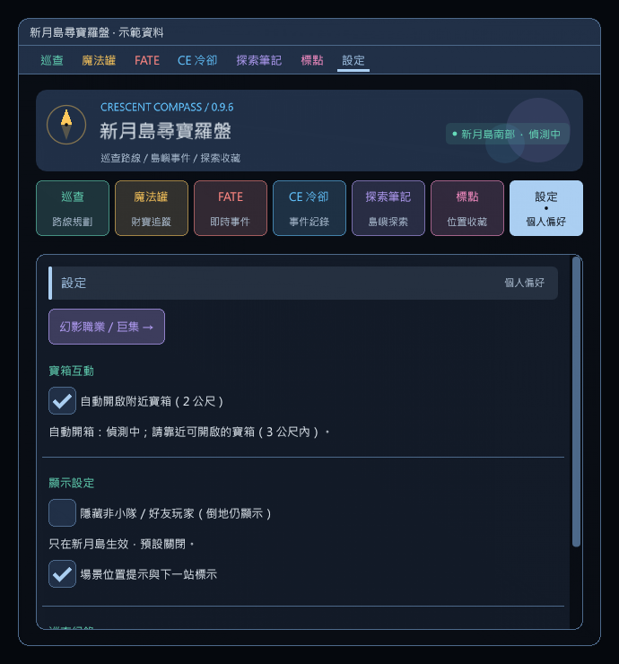
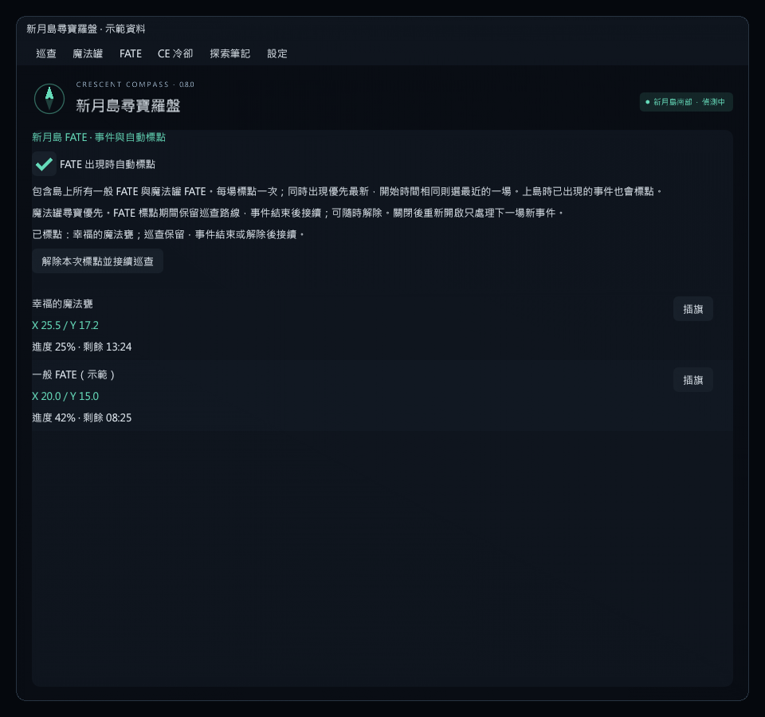
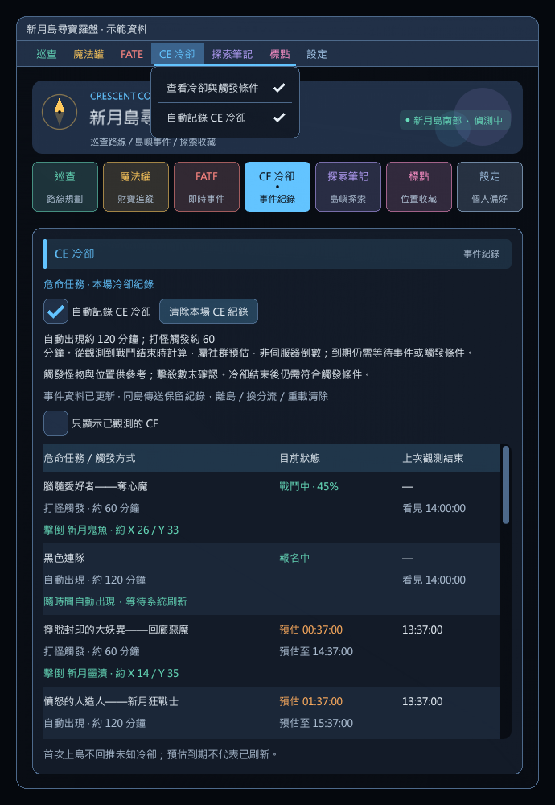
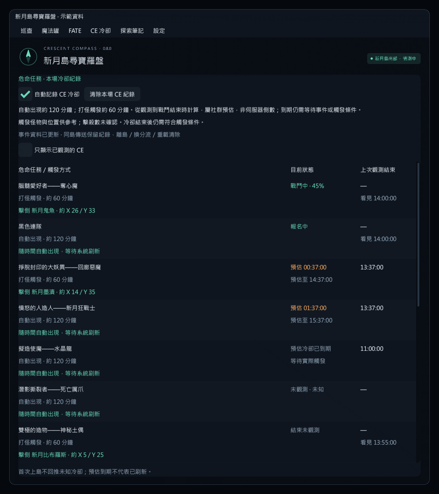
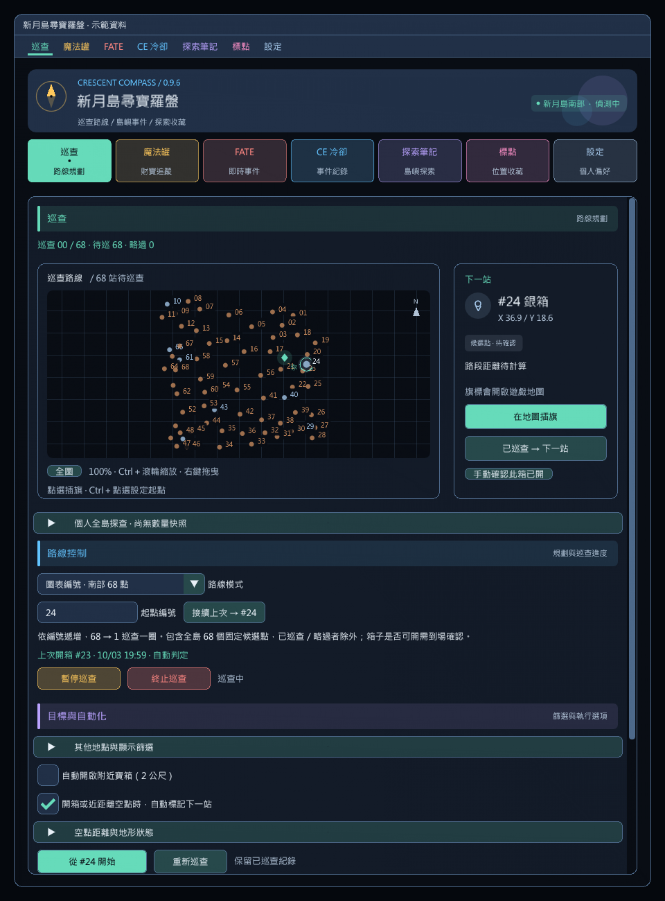
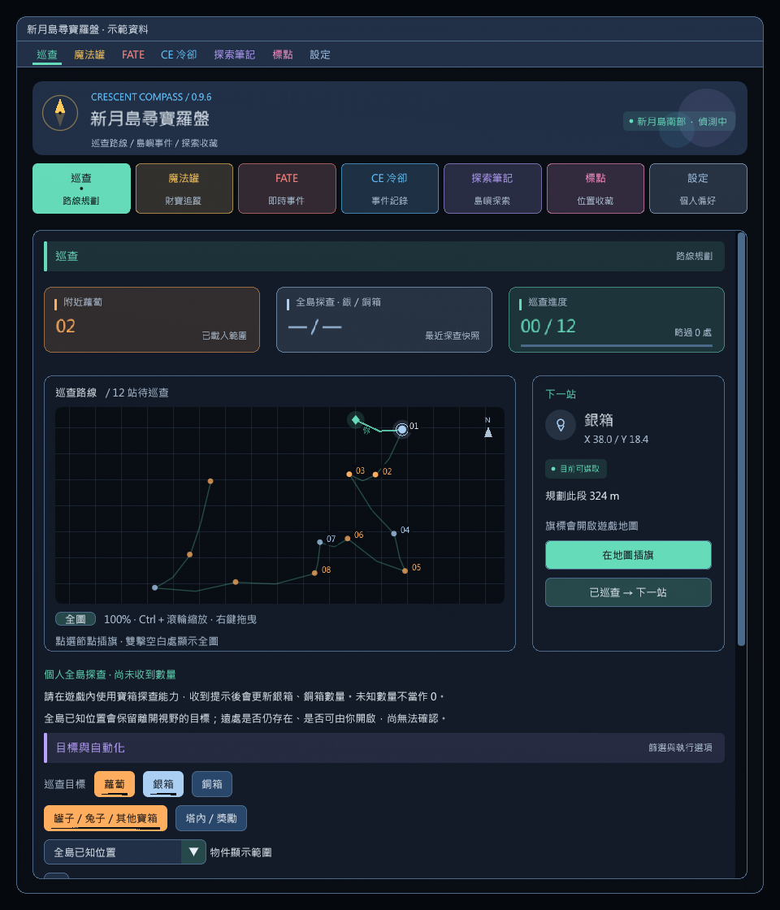
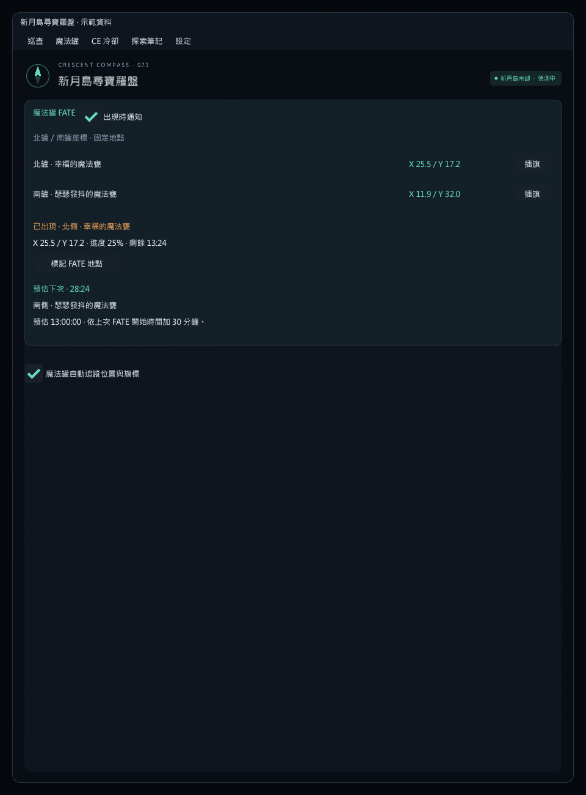
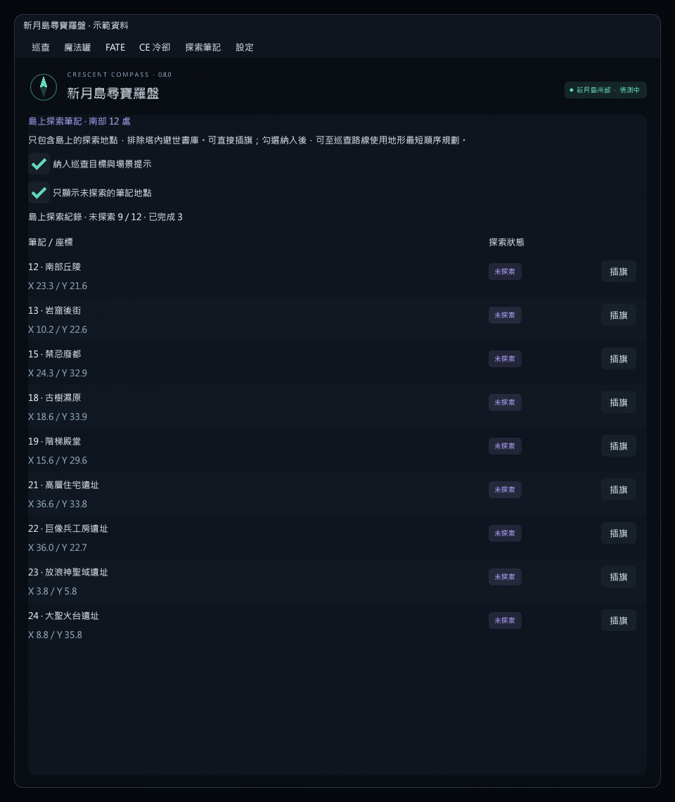

# 版本紀錄

歷史版本的驗證數量與遊戲驗收狀態為當時紀錄；目前使用與建置方式見 [README](README.md)。

## 0.10.24 · 2026-10-07

- 取消遊戲右上角小地圖的蘿蔔位置與權重顯示，移除相關設定、原生介接與專用測試；不影響插件內的巡查路線圖。
- 保留蘿蔔表格優化：距離、目前站標示、排序、隱藏 0 權重、插旗及任意點拾取確認。可開關的獨立浮窗預設關閉，標題可拖曳並記住位置。
- 一併發布先前本機修正：「已巡查」權重歸零、手動採集與報點更新權重、不更動原巡航，以及 #6／#7 交換。
- 2,285 項核心檢查及 55 組蘿蔔／既有巡查介面測試通過，Release 零警告、零錯誤；遊戲內採集與巡航情境仍待實測。

## 0.10.23 · 2026-10-07（本機建置，未發布；小地圖功能於 0.10.24 取消）

- 蘿蔔表格改為緊湊欄位、固定表頭與目前站醒目標示；保留權重／編號排序、插旗、拾取確認與重設，新增隱藏 0 權重。窄版自動隱藏座標欄，滑鼠提示仍可查看座標。
- 新增可開關的蘿蔔搜尋浮窗，預設關閉；拖曳標題移動並記住位置，關閉主視窗後仍可看表格、依其他玩家報點標記拾取，不要求選擇蘿蔔路線。
- 設定頁與蘿蔔巡查頁新增遊戲右上角小地圖的「蘿蔔位置」與「顯示權重」開關。位置預設關閉，權重偏好獨立保留；關閉顯示不影響背景觀測或權重。
- 小地圖以唯讀方式取得縮放、朝向與 HUD 位置，再疊加附近候選點；不改原生標記陣列、不攔截滑鼠。文字避讓、圓形邊界及無效版面檢查，擁擠時保留點位並省略標籤。
- 2,303 項核心檢查、43 組蘿蔔介面測試通過；本機繁中小地圖 ULD 結構核對通過。實際遊戲縮放、旋轉與 HUD 比例對位仍待進島驗收。

## 0.10.22 · 2026-10-07（本機建置，未發布）

- 修正蘿蔔「已巡查 → 下一站」只移除站點卻未清零權重；現在該點歸零，不增加拾取數。
- 拾取偵測獨立於自動巡查，手動採集、暫停、沒有路線或離開原巡航點時仍可更新。核對單次幸運胡蘿蔔消耗與使用／新兔子箱證據，自動與手動流程共用同一筆權重更新。
- 權重清單新增逐點「已拾取」與任意編號「標記已拾取」，支援其他玩家報點。確認後依既有模型加權、上限 +2，不更動巡航站點、順序、旗標或暫停狀態；舊確認遇到新觀測或換場時失效。
- 依回報交換蘿蔔 #6、#7 的編號與巡航順序，原資料庫座標不變。
- 2,285 項核心檢查、33 組蘿蔔與既有巡查介面測試通過，Release 零警告、零錯誤；遊戲內手動消耗與各點高度仍需實測。

## 0.10.21 · 2026-10-07

- 安裝包瘦身：只保留執行必要檔案、icon、授權與簡短說明；完整文件及截圖移至原始碼包與 GitHub。新增 ZIP 精確清單、版本與檔案雜湊檢查，不修改 DLL、遊戲功能或玩家設定；既有公開安裝包不覆寫。
- 新增「蘿蔔路線 1～25」，依提供圖表映射既有南部座標，可指定起點走一圈；沿用 vnavmesh 快取、預算與卡住恢復。`/crescent route carrot` 可選擇並規劃，不新增傳送。
- 全 25 點顯示 0／+1／+2 搜尋權重，可排序、插旗與重設。查空歸零，確認拾取後全點加一、上限二；清單排序不改固定巡航，不當作精確機率。
- 參考 BOCCHI 蘿蔔互動流程：下坐騎並停穩後使用幸運胡蘿蔔，確認消耗才加權，等待並開啟新兔子箱；同點第二根保留。背包資料延遲不重送，逾時／觀測中斷停止，近距離地面可達才確認空點。
- BOCCHI 南部採動態最近鄰而非固定 1～25 路線檔；本版依使用者圖的順序，不宣稱圖片紅線能保證無障礙。
- 2,232 項核心檢查、蘿蔔及既有巡查離線 UI 驗證通過，核對繁中道具、事件箱與 SDK 使用特徵碼；遊戲內道具使用與地形仍待驗收。詳見 [蘿蔔巡航](docs/CARROT_PATROL.md)。

## 0.10.20 · 2026-10-07（本機建置）

- 魔法罐「共享時間診斷（暫時）」新增「重新抓取時間」。進島仍只自動查詢一次；額外查詢只由手動點擊觸發，不上傳、不輪詢。
- 手動重試使用最新 FATE 指紋，請求間隔至少 10 秒，等待資料／HTTP 中禁止連點。未就緒最多等待 60 秒；島外、傳送、開關關閉、已有本機或共享倒數時停用，不重設計時。
- 診斷升級 `pot-debug-3`，顯示自動／手動實際次數與停用原因。重試保留真正進島時間，拒絕上次請求的晚到結果，仍以本機觀測優先。
- 2,125 項核心檢查與離線 UI 操作、窄版／短視窗／150% 字體驗證通過；真實副本的共享資料可用性仍待遊戲內驗收。

## 0.10.19 · 2026-10-07（本機建置）

- 匯入 BOCCHI commit `400de1ca05a327f016978168560d511e74ff5eed` 的南部 68 點／7 區段順序與預計算距離資料，預設使用 BOCCHI 分區順序，原圖表 1～68 順序仍可切換。
- 指定起點仍使用原圖表編號；依所選順序旋轉一圈，已巡查／略過／確認開啟點維持既有排除規則。「接續上次」改按所選順序找下一站，不改寫開箱紀錄。
- 顯示當前分區與已知站間參考距離／路段數。上游 1856 只有三筆出發距離，缺值保持未知；參考距離不作路徑、可達性或提前空點依據。
- 新增 `/crescent route bocchi` 與 `/crescent route chart` 規劃指令。切換順序會停止舊巡查，保留本場紀錄；不自動啟動移動。跨區段仍走地面，不新增傳送、返回營地或 BOCCHI 執行期依賴。
- 2,072 項核心檢查通過；含所有 68 種起點、節點對應、分區、續巡、缺值／錯誤資料、方向距離及固定路徑快取。API 13 編譯與窄版／150% 字體／選單操作離線驗證通過；尚未遊戲內驗收。

## 0.10.18 · 2026-10-07（本機建置）

- 參考 BOCCHI 障礙物處理：3 秒無路程進展先嘗試原生跳躍，每 2 秒最多一次、同站最多 5 次；保留導航，落地後才檢查進展或開箱，不用原地跳躍重設卡住計時。
- 6 秒仍無進展時查詢側移／後退通路，側向距離擴大至 8／10／12 公尺，候選透過可用的網格貼點介面驗證；每站仍最多 3 次恢復，不直接走向未驗證候選。
- 修正近距離快取接回可能撞到牆角：移除 1.5 公尺直接接回，偏離原折線時先查短地面接入段，保留長路段快取。北部特定繞障座標不套用到南部。
- 保留戰鬥中巡查與開箱、無怪物偵測、手動停止和外部導航優先。核對本機繁中跳躍動作及 SDK 特徵碼；實際地形脫困仍待遊戲驗收。
- 1,765 項核心檢查與離線巡查介面預覽通過，API 13 Release 編譯零警告／錯誤。尋路起點變更時放棄舊結果；跳躍到站且路徑自然結束時，仍等待落地停穩再開箱。

## 0.10.17 · 2026-10-07（本機建置）

- 自動巡查不再因戰鬥停止：正在走的路段繼續沿用，空點確認、換站與卡住恢復照常運作。
- 戰鬥中到達目前站也照常停穩並嘗試開箱，保留距離、可選取、讀條／動畫及遊戲原生互動檢查；只有確認開啟才記錄完成。
- 倒地、手動暫停、讀條／過場、傳送及外部導航接手等限制不變。獨立附近開箱在未啟動自動巡查時仍保留戰鬥暫停。
- 1,709 項核心檢查通過；遊戲內持續巡查與伺服器接受開箱仍待驗收。

## 0.10.16 · 2026-10-07（本機建置）

- 全面取消巡查怪物掃描、等級／警戒判斷、繞背、聽覺標記指令與自動步行；保留角色進入戰鬥時的暫停。
- 卡住門檻改為 6 秒無路程進展。清除失敗路段快取，拒絕重新穿過卡點的路徑，查詢側移／後退替代地面通路；每次最多 9 個查詢／14 秒，每站最多 3 次恢復。失敗保留箱點，手動中止與其他導航接手不自動搶回。
- 魔法罐改用 OccultOverlay／Eureka Linker 共用的 OccultTrackerV3 API，一個 GET 比對最多 16 個精確 FATE 指紋。只讀取唯一匹配副本的最近魔法罐時間；不上傳、不重試、之後本機倒數。
- 診斷升級 pot-debug-2，區分查無副本、缺少魔法罐紀錄、模糊匹配、格式／時間問題與網路錯誤，保留完整查詢指紋。實際遊戲地形與繁中共享資料命中仍待驗收。
- 1,680 項核心檢查、離線 UI 操作與窄版／150% 字體檢查通過，API 13 Release 編譯零警告／錯誤。全零假指紋的唯讀連線測試取得 HTTP 200／空陣列，未上傳玩家或魔法罐觀測資料。

## 0.10.15 · 2026-10-07（本機建置）

- 自動巡查保留 68 點編號順序，啟動不再等待整圈地形計算；當前路段先行，移動時預算下一段。快取命中不受背景查詢阻塞，偏離路線時可查詢短接入段接回原路。
- 參考 BOCCHI 固定巡查與空點確認流程：同層 20 公尺內，或 60 公尺內且鄰近箱體已有載入證據時，以已確認的地面距離及連續三次掃描、至少 1 秒確認空點並前往下一站。空點只記略過，不記已領取。
- 巡查開箱先停止並確認角色穩定 250 毫秒，每 500 毫秒最多一次互動；讀條／開啟動畫時等待，原生狀態及戰利品清單共同判定已開啟。獨立附近開箱仍維持原本每秒一次、不強制停步的行為。
- 以剩餘實際路程偵測卡住，15 秒無進展僅重算當前路段，最多兩次；手動停止或其他導航接手不自動搶回控制。繞背可在障礙後接回原折線，不因稀疏路點重算整段長路。
- 保留聽覺怪步行、低知識等級且未交戰怪物排除、事件優先及換角色／分流停止。1,696 項核心回歸、離線 UI 操作與窄版／150% 字體檢查通過，API 13 編譯零警告／錯誤；實際遊戲內開箱、地形與物件載入邊界仍需驗收。

## 0.10.14 · 2026-10-06

- 魔法罐下一場預估倒數進入 5 分鐘內時，發送一次 Dalamud 彈出通知與個人聊天提示，顯示南／北罐、名稱、實際剩餘倒數及預估時間。
- 預設開啟，魔法罐頁與下拉選單提供「預估剩 5 分鐘時通知」；與出現通知、倒數浮窗各自獨立，主介面關閉仍有效。
- 同一輪只提醒一次，時間校正不重播；未知、已逾時或掃描暫停時不提醒，同島恢復時若仍在 5 分鐘內可提醒。關閉後不補發當輪已略過的提醒，換分流、離島與登出重建計時。
- 新增 26 項提醒檢查，合計 1245 項核心驗證通過。Release 編譯零警告／錯誤，已檢視一般、窄版與放大字體預覽；遊戲內通知仍待驗收。

## 0.10.13 · 2026-10-05

- 巡查固定採用南部 68 點圖表編號順序，移除路線模式選單，保留任選起點、接續上次、暫停／繼續及終止。
- 地點清單固定為全島已知位置，移除物件顯示範圍選單；種類與探索筆記篩選只影響地點清單及場景提示，不改動 68 點路線。
- 開箱或確認近距離空點後固定自動標記下一站，移除勾選與空點距離滑桿；內部維持水平與步行距離 60 公尺、高差 8 公尺、連續 3 秒的空點判定。
- 舊設定中的路線模式、顯示範圍、自動下一站開關及距離不再生效，其他設定保留。8 組實際設定反序列化與往返保存檢查、1219 項核心檢查及離線 ImGui 介面驗證通過；遊戲內仍待驗收。

## 0.10.12 · 2026-10-05

- 巡查浮窗加入「下一站」「暫停／繼續」「終止」，直接使用既有巡查操作。鎖定只固定位置，按鈕仍可操作；解鎖後拖曳標題移動。
- 只在有剩餘站點或路線規劃時顯示，暫停時保留供繼續；最後一站完成、終止或尚未開始時自動隱藏，解鎖位置也不顯示閒置浮窗。
- 離線驗證鎖定／解鎖狀態的按鈕操作、暫停後繼續、最後一站與終止後隱藏，以及規劃／事件優先／遊戲忙碌時停用下一站。Release 編譯零警告與錯誤，遊戲內仍待驗收。

## 0.10.11 · 2026-10-05

- 新增獨立巡查進度浮窗：主介面關閉後仍顯示下一站編號／種類、座標、直線距離、進度條及已巡查／略過／待巡數量。
- 「巡查」與「設定」頁及巡查下拉選單可開關，預設關閉；位置可拖曳、保存與重設，鎖定後滑鼠穿透，與魔法罐倒數分開設定。
- 暫停、規劃、魔法罐／FATE 優先及本輪完成分別顯示狀態；終止巡查、離島或載入時隱藏。調整模式可在尚未規劃時先定位。
- Release 編譯及離線浮窗開關、拖曳、滑鼠穿透、150% 字體與雙浮窗顯示檢查通過；遊戲內仍待驗收。

## 0.10.10 · 2026-10-05

- CE 地圖放大／縮小時，BOSS 圖標、名稱、狀態與倒數同比例縮放；標籤背景、間距、避讓及點擊範圍同步調整。
- 檢視一般、150% 字體及最大／最小倍率的離線預覽，驗證放大後的圖標點選及座標插旗；遊戲內仍待驗收。

## 0.10.9 · 2026-10-05

- 魔法罐倒數改用明確的「調整位置／完成調整」按鈕；解鎖後可拖曳整個浮窗內容區移動，放開滑鼠即保存位置，完成後恢復滑鼠穿透。
- 離線操作檢查涵蓋浮窗內容區拖曳、保存位置、開關與鎖定；遊戲內仍待驗收。

## 0.10.8 · 2026-10-05

- 新增可開關的魔法罐倒數浮窗；主介面關閉後仍顯示目前事件剩餘時間與下一場南／北罐預估倒數，沒有本場紀錄時顯示未知。
- 「魔法罐」與「設定」頁可開啟、鎖定或重設位置；預設關閉，解鎖後可拖曳，鎖定後滑鼠穿透。設定與位置會保存；離島、傳送、過場、Gpose 或隱藏遊戲介面時隱藏浮窗。
- 沿用既有本場 FATE 計時資料。1219 項核心檢查與離線浮窗顯示、開關、拖曳、縮放、位置復原及滑鼠穿透驗證通過；遊戲內仍待驗收。

## 0.10.7 · 2026-10-05

- CE 冷卻改為新月島南部原生地圖：15 個 CE 在各自位置顯示遊戲原生 BOSS／戰鬥圖標、名稱與預估冷卻；未知、報名、戰鬥及到期狀態分開顯示。
- 點選 BOSS 查看觸發條件；BOSS 座標與六種觸發怪活動座標可直接點擊插旗。支援 Ctrl＋滾輪縮放、拖曳、全圖與已觀測篩選，島外／北部／傳送期間停用插旗。
- 15 個名稱、位置、圖標與地圖投影通過繁中遊戲資料核對；1219 項核心檢查及離線 ImGui 操作驗證通過。遊戲內實際插旗仍待驗收。

## 0.10.6 · 2026-10-05

- 隱藏玩家加入好友名單快取，保留非小隊好友：角色 ID 優先，缺少 ID 時比對名字與原始伺服器，不只依賴角色關係旗標。
- 島外讀取名單並按登入角色儲存於本機，島內與插件重載後沿用；設定頁顯示快取人數，缺少快取時暫停隱藏。新增／移除好友後需在島外更新。
- 1197 項核心檢查通過，繁中客戶端好友名單入口已離線核對；島內未組隊好友的實際顯示仍待驗收。

## 0.10.5 · 2026-10-05

- 修正售出後切到回購列表便卡住：出售列表與回購列表皆允許繼續售出背包垃圾，保留目前分頁，不操作回購買入。
- 回歸測試重現舊判斷拒絕回購分頁；修正後 1172 項核心檢查通過，包含第一筆售出後自動切換到回購頁再接續第二筆。遊戲內仍待實測。

## 0.10.4 · 2026-10-05

- 修正第一種售出後停在等待商店就緒：繁中客戶端完成售出不會清除 `WaitingForSellConfirm`，不再將此殘留旗標當作商店忙碌；改檢查確認代理的視窗 ID 與交易回應狀態。
- 加入第一筆確認旗標殘留時仍接續第二種物品，以及交易未完成時保持等待的回歸驗證；1162 項核心檢查通過，遊戲內仍待實測。

## 0.10.3 · 2026-10-05

- 加入不同種類垃圾接續售出的回歸驗證，包括第二種物品需要售出確認的情況。
- 細分商店載入、交易回應、售出確認與頁面切換的等待提示。
- 1147 項核心檢查通過；遊戲內連續售出仍待實測。

## 0.10.2 · 2026-10-05

- 修正自動售出停在遊戲確認視窗：精確核對本次整疊交易後自動確認，背包更新後接續下一疊。
- 每筆確認只送出一次；商店切換停止，其他視窗、購買交易與數量不符不確認。
- 1143 項核心檢查通過，原生售出確認代理已離線核對；遊戲內連續交易仍待實測。

## 0.10.1 · 2026-10-05

- 「保留」欄改為「丟棄」：勾選標記垃圾，未勾選保留；原有垃圾設定維持相同物品。
- 選單、導覽卡片及頁面名稱統一為「背包整理」，卡片僅顯示此名稱。

## 0.10.0 · 2026-10-05

- 新增倒垃圾選單與 /crescent loot，292 種已記錄寶箱物品預設保留，可搜尋、篩選與逐項標記垃圾。
- 支援島內自動丟棄，以及一般 NPC 商店自動售出；只處理一般背包並保護 HQ、收藏品及加工裝備。
- 單筆等待、重新核對槽位、8 秒逾時停止；規則變更／登出會停止，啟動狀態不跨載入保存。
- 本機原生特徵碼已核對；實際遊戲內丟棄／售出仍待驗收。詳見 [倒垃圾說明](docs/LOOT_CLEANUP.md)。

## 0.9.7 · 2026-10-03

本次發布包含下列 0.9.5～0.9.7 開發內容，自訂套件庫由 0.9.4 更新至 0.9.7。

- 單行 `/crescent job ...` 巨集的預設 M 圖示，自動換成對應幻影職業圖示，支援個人／共用巨集並刷新快捷列。
- 新增「更新快捷列圖示」按鈕與 `/crescent jobicons`；保留自訂圖示、巨集名稱／文字及快捷列位置。
- 1104 項核心檢查及職業頁互動檢查通過；原生圖示與儲存函式已離線核對，遊戲內刷新與保存仍待驗收。

## 0.9.6 開發內容（隨 0.9.7 發布）

- 自動開箱在 2 公尺內首次掃描便嘗試，取消停穩等待及三次上限，每秒最多互動一次；多個寶箱依序嘗試，支援地面騎乘。
- 新增 `/crescent job 職業名稱或編號` 巨集指令，以及 `/crescent jobs` 的 13 種職業圖標、目前職業、複製巨集與直接切換。
- 切換結果依遊戲職業資料確認；未解鎖、冷卻或狀態限制由遊戲判定，不會無限重送職業指令。
- Release 編譯及 984 項核心檢查通過；實際開箱和職業切換仍待遊戲內驗收。

## 0.9.5 開發內容（隨 0.9.7 發布）

- 新增標點俯視圖、四個力之塔王房輪廓與手動場地切換。
- 顯示北方、網格、標點 XYZ／高度差與輪廓外提示，預覽不改動現場。
- 場地為公開資料的靜態示意，繁中場地尚待實測。

## 0.9.4 後續調整

- 七色功能導覽卡片、巡查地圖優先版面及放大文字。
- 自動開箱支援地面騎乘；飛行、乘客與上下坐騎期間暫停。
- 文件、介面原始碼與驗證流程整理。

## 0.9.4 自動開啟附近寶箱（本機測試版）

輸入 `/crescent`，在「巡查」或「設定」勾選 **自動開啟附近寶箱（3 公尺）**。預設關閉，設定會保留；關閉視窗後仍持續偵測。自行走近後（支援地面騎乘），會依距離嘗試開啟已載入、可選取且未開啟的一般寶箱與魔法罐／兔子寶箱。無須規劃路線，開箱不受地圖顯示篩選影響。

戰鬥、讀條、傳送、倒地及暫停巡查時停止互動。每 5 秒最多嘗試一次，同一寶箱最多 3 次；已開啟或正在開啟的箱子會跳過。使用遊戲互動介面，保留其視線與距離檢查；不會自動走路或處理其他對話。詳見 [自動開箱說明與驗收](docs/AUTO_CHESTS.md)。

適配繁中 **Dalamud API 13**。822 項核心檢查及介面開關測試通過，已核對本機繁中客戶端的互動函式；實際遊戲開箱仍待驗收。此版尚未發布至下方套件庫，本機更新包為 `dist/CrescentCompass-0.9.4-api13.zip`，DLL 位於 `CrescentCompass/bin/Release/`；更新時需一起替換主 DLL 與 Core DLL。

## 0.9.3 新月島標點預設

新增「忽略距離（使用預設座標）」：在標點頁選取預設後勾選，再按「放置標點」。啟用時直接使用完整 XYZ，略過插件的 200 公尺限制與地面校正。此選項預設關閉，切換後會儲存。仍須非戰鬥、同區域，且由遊戲接受操作；遠距放置尚待遊戲實測。

0.9.2 修正部分地面碰撞資料沒有填入法線，導致正常地面被拒絕放置的問題。使用碰撞三角形計算地面方向；已符合預設的標點跳過地面檢查。儲存／匯入後自動選取該筆預設，避免繼續使用上一筆。操作結果與失敗原因顯示在「放置標點」按鈕下方，完全相同時明確提示「標點已在儲存位置」。測試時先儲存，再移動或清除現場標點，最後按「放置標點」。

輸入 `/crescent waymarks`，或選「標點 → 儲存、匯入與還原」。支援儲存現場 A–D／1–4、Waymark Preset JSON 匯入／匯出、日期時間、搜尋、重新命名與個別刪除。預設獨立保存，不設 3／50 筆上限。

新月島南部未開放原生預設槽，所以使用逐點放置。一般模式要求非戰鬥、需放置的目標在 200 公尺內，先檢查所有需變更目標的地面；忽略距離模式直接使用預設座標。兩者皆至少間隔 600 ms，取代現場同名標點並清除本預設未啟用的槽位；戰鬥、換區、傳送或登出時停止。詳見 [使用方法與相容性](docs/WAYMARKS.md)。

適配繁中遊戲 **2026.09.14.0000.0000 / API 13**。782 項核心檢查通過，包含儲存、清除、重放及忽略距離的離線回歸流程；實際遊戲放置仍待驗收。此版尚未發布至下方套件庫；本機產物為 `dist/CrescentCompass-0.9.3-api13.zip`，DLL 位於 `CrescentCompass/bin/Release/`，更新時需一起替換主 DLL 與 Core DLL。

## 0.8.0 CE 觸發條件與一般 FATE 自動標點

- **CE 冷卻 → 查看冷卻與觸發條件**：每列顯示觸發方式；六種打怪 CE 顯示繁中怪物名稱與大致座標，其餘顯示隨時間自動出現。冷卻到期不保證立刻觸發，擊殺數未確認。也可輸入 `/crescent ce`。
- 新增獨立 **FATE → 事件與自動標點** 選單，或 `/crescent fate`。**自動標點預設開啟**，涵蓋新月島所有一般 FATE（包含魔法罐 FATE），不把 CE 冷卻到期視為 FATE 出現。
- 每場只標點一次；上島時已存在的事件也會標點。多場同時偵測時優先最新開始者，同時開始則選最近一場；其餘可在清單手動插旗。關閉後重新開啟只處理下一場新事件。
- 魔法罐尋寶優先；讀條／互動期間等待。FATE 標點期間保留巡查路線，事件結束或按「解除本次標點並接續巡查」後接續。只插地圖旗標，不自動移動。

676 項核心檢查通過；API 13 編譯零警告、零錯誤。已驗證六個選單切頁、窄版及放大字體預覽。實際遊戲中新 FATE 出現、插旗和巡查接續仍待操作驗收。詳見 [CE 觸發條件](docs/CE_COOLDOWNS.md) 與 [FATE 自動標點](docs/FATE_AUTO_FLAGS.md)。

## 0.7.1 頂部下拉選單與 CE 入口

- 功能分類改為桌面式頂部選單列：**巡查／魔法罐／CE 冷卻／探索筆記／設定**。點開選單後，第一項開啟對應頁面，下方提供常用操作與開關。
- 開啟 **CE 冷卻 → 查看冷卻紀錄**，或直接輸入 `/crescent ce`。尚未上島也能查看南部 15 個 CE 清單；沒有本場觀測資料時顯示未知。
- 視窗顯示實際載入 DLL 的版本。若看不到 CE 入口，先確認版本至少為 0.7.1；使用 Dev Plugin Locations 時，需要更新該路徑的本機 DLL，GitHub 套件庫更新不會替換開發路徑檔案。

644 項核心檢查通過；已驗證五個原生下拉選單的實際點擊、切頁不觸發功能操作、島外 CE 清單、窄版／放大字體與 Ctrl＋滾輪地圖縮放。CE 冷卻仍依本場觀測推估，遊戲內事件生命週期與實際間隔待驗收。

## 0.7.0 CE 冷卻與功能分類選單

- 新增南部 **15 個 CE** 自動紀錄：報名、準備、戰鬥、上次觀測結束、預估冷卻。打怪觸發類約 60 分鐘、自動出現類約 120 分鐘；由連續觀測到戰鬥結束起算，並非伺服器倒數。到期顯示等待觸發，不假設已刷新。
- 上島前未觀測到的 CE 顯示未知。傳送保留已知冷卻；若中斷期間錯過結束，不補造時間。離島、換分流、登出、換角色或重載清除本場紀錄；可關閉追蹤或手動清除 CE 紀錄。
- 現有功能分為 **巡查路線、魔法罐、CE 冷卻、探索筆記、設定** 五個選單，各頁獨立捲動。切頁不停止追蹤、不重設路線；視窗關閉仍會更新。Dalamud 設定按鈕直接開啟設定頁。
- 玩家隱藏與場景提示移至「設定」；未探索篩選與筆記插旗移至「探索筆記」；魔法罐 FATE 倒數、南北座標與尋寶集中於「魔法罐」。

**644 項核心檢查通過**；API 13 編譯零警告、零錯誤。已驗證 ImGui 五頁點擊不觸發功能操作、Ctrl＋滾輪地圖縮放，並檢視窄版與放大字體預覽。CE 名稱已核對本機繁中遊戲資料；遊戲內事件生命週期與實際冷卻時間仍待驗收。詳見 [CE 冷卻與選單說明](docs/CE_COOLDOWNS.md)。

## 0.6.1 魔法罐第二處財寶提示修正

- 修正「撒嬌甕似乎能夠告知第二處財寶所在地！」未被辨識，導致搜尋仍停留在第一處財寶的問題。辨識本機確認的 NPC 名稱後，自動切換加碼候選點；互動結束後同步旗標。
- 修正繁中實際方向「正北／正東／正南／正西」漏判，第二處財寶與一般尋寶都能繼續依提示縮小範圍。保留既有八方向別名。
- 補齊聖靈藥提示中的 NPC 與「魔法聖靈藥」道具名稱；仍限制系統／NPC 頻道及完整訊息，不接受任意前綴或玩家引述。

已以本機繁中 LogMessage 巨集及名稱表核對，**605 項核心檢查通過**，包含以完整顯示文字驗證「第一箱 → 第二處提示 → 方向 → 第二箱座標 → 自動旗標」流程。遊戲內第二次尋寶仍待實際操作驗收。詳見 [提示查核紀錄](docs/audit/pot-hint-templates.txt)。

## 0.6.0 圖表 68 點、巡查控制與地圖縮放

預設使用使用者提供的南部寶箱圖表順序，**68／68 點一對一對應**現有繁中場景座標，包含 60 銅箱、8 銀箱。原圖銀箱編號為 10、24、29、40、43、49、61、66；所有編號固定，不隨目前待巡站數重新編號。

- 輸入起點編號或在地圖 **Ctrl＋點選**，再按「從 #XX 開始」。例如從 24 開始：24 → 68 → 1 → 23，巡查一圈，保留本場已巡查／略過紀錄。重新巡查從上輪未完成首點接續。
- **暫停／繼續／終止**可直接操作，也有 `/crescent pause`、`resume`、`stop`。同島同分流傳送保留使用者暫停狀態；終止會取消待恢復的計算與旗標，不會落地後自行重啟。魔法罐追蹤有獨立開關。
- 顯示並依角色儲存**上次開箱編號、時間與判定來源**，重載後可接續下一號。自動判定需自己的對箱讀條與同一箱已開狀態；只經過、空點略過、手動「已巡查」不寫成開箱。漏判時可按「手動確認此箱已開」。此紀錄不是伺服器領取清單。
- 地圖支援 **Ctrl＋滾輪**以滑鼠位置縮放、右鍵／中鍵拖曳、全圖還原；推進下一站保留縮放與位置。全部 68 點可先查看，已巡查點淡化。
- 圖表模式只包含這張圖的南部野外寶箱，不插入蘿蔔、探索筆記、塔內或魔法罐箱。其他地點仍可查看與插旗，也可切回「地形最短順序」規劃。圖表模式的 vnavmesh 只計算站間走法，不更動編號順序；查不到路的站保留並提示。

555 項核心檢查通過；ImGui 輸入測試確認 Ctrl＋滾輪縮放且不捲動父視窗。編譯 0 警告、0 錯誤，已檢視寬版、窄版、暫停與縮放預覽。遊戲內開箱讀條擷取、旗標及傳送接續仍待實際操作驗收。詳見 [圖表巡查說明](docs/CHEST_CHART.md)。

## 0.5.4 玩家顯示開關

在視窗上方新增「隱藏非小隊／好友玩家（倒地仍顯示）」，**預設關閉，只在新月島生效**。

- 開啟後隱藏其他玩家模型，保留自己、小隊成員、好友與倒地玩家。已隱藏的玩家倒地後恢復，復活後若仍非小隊／好友則再次隱藏。
- 小隊或好友關係改變會在框架更新時重新判斷。關閉、離島、傳送、過場、合照或卸載插件時，撤回本功能對目前載入角色設定的隱藏位元。
- 只處理本機玩家模型；名字牌、目標選取、NPC、寵物與坐騎不另外修改。既有巡查路線與探索篩選維持原狀。

455 項核心檢查通過，編譯 0 警告、0 錯誤；已檢視開關、人數及窄版預覽。實際隱藏、倒地恢復及卸載還原仍待遊戲內驗收。詳見 [玩家顯示說明](docs/PLAYER_VISIBILITY.md)。

## 0.5.3 只顯示未探索的筆記

開啟「島上探索筆記」後，「只顯示未探索的筆記地點」預設勾選。依目前角色的**遊戲內完成狀態**，篩選南部島上 12 處地點，並顯示未探索／已完成數量。

- 每 0.5 秒讀取遊戲解鎖狀態；已完成地點從清單、場景提示與待巡路線移除。完成首站且自動下一站開啟時，互動結束後標記下一站，魔法罐尋寶仍優先。
- 取消勾選可查看全部固定地點（仍排除本輪手動已巡查者），以「未探索／遊戲內已完成」區分。重新巡查與清除手動紀錄不改遊戲完成狀態。
- 首次資料未就緒時顯示等待，不把未知當作未探索；後續讀取失敗會明示沿用本角色上次結果。登出或換角色後重新讀取；同島傳送保留既有紀錄。
- 保留原有探索開關、寶箱範圍、空點距離與魔法罐設定。範圍仍只限島上 12 處，不加入塔內避世書庫。

427 項核心驗證通過，編譯 0 警告、0 錯誤；已檢視未探索、全部地點與資料未知的離線介面。繁中 SDK 查詢及 12 個解鎖欄位已核對，實際角色完成與更新流程仍需遊戲內驗收。詳見 [探索紀錄說明](docs/EXPLORATION_AND_SURVEY.md)。

## 0.5.2 傳送接續與最短步行順序

- 修正傳送讀取畫面會清空路線。**同島同分流傳送**保留待巡點、已巡查與略過紀錄；落地穩定、導航就緒後，從新位置重算待巡順序。真正離島、登出或換分流才重建場次資料。
- **12 站以內**比較所有方向的站間地面路程，以動態規劃求目前路程模型及優先條件下的最短開放路線。超過 12 站增加移站與路段反向排列改善，屬近似解；不假設上坡與下坡距離相同。
- 下一站會從角色目前位置重新尋路，顯示「前往約」距離；開啟場景提示時顯示附近的地面路徑轉折。路線圖其餘段落保留規劃時的站間路徑。
- 已規劃的站點不因暫時離開載入範圍被刪除，包含「目前可選取」模式；地點清單仍遵守顯示篩選。傳送後路徑暫時失敗時保留原本路線，可重新規劃。

離線驗證涵蓋同區傳送、暫時零分流、換區／分流、長時間載入、未載入站點保留、地形最短順序與暴力枚舉比對。實際傳送與尋路畫面仍需遊戲內驗收。

## 0.5.1 探索筆記只保留島上地點

「島上探索筆記」限新月島南部島上的 **12 處**地點，排除第 30 處塔內「避世書庫」。地點清單、場景提示、單點旗標與巡查路線統一使用這 12 處；開啟塔內寶箱篩選也不會加入塔內探索點。既有探索開關設定保留。

## 0.5.0 地形步行路線

寶箱巡查改用 **vnavmesh 地面尋路距離**，納入繞路與坡道，再改善巡查順序；重新巡查保留上輪未巡查點優先。需啟用 vnavmesh，等待介面顯示「地形導航已就緒」後規劃。

- 顯示規劃時步行路徑、每段路程、計算進度與取消按鈕。導航未就緒時提示等待，不以直線取代。
- 查不到完整接續路徑的點另列，可插旗查看，保留未巡查紀錄；修改篩選、切站或換區會取消舊計算。
- 空點略過增加目前步行距離檢查，隔牆雖近但仍需繞路時不提前略過。已確認開啟仍能直接切換下一站。
- 規劃屬近似最佳化，未計入敵人、機關解鎖與傳送時間；圖上距離為規劃快照，並非角色即時剩餘距離。

345 項離線驗證通過，編譯零警告、零錯誤；已確認遊戲載入 0.5.0，實際地形路線與 IPC 尋路結果仍待遊戲內驗收。詳見 [地形路線說明](docs/WALKING_ROUTES.md)。

## 0.4.5 北罐／南罐固定座標

魔法罐 FATE 面板常駐顯示當前區域的「北罐／南罐座標」，兩列各有插旗按鈕。尚未偵測到事件、倒數未知或通知關閉時也可查看固定地點，不必等待 FATE 出現。

南部的北罐「幸福的魔法甕」為 **X 25.5 / Y 17.2**，南罐「瑟瑟發抖的魔法甕」為 **X 11.9 / Y 32.0**。兩點已由繁中客戶端 `Fate.Location` 對應場景位置核對；插旗使用完整世界座標與該區域地圖，不使用畫面上四捨五入後的數字。固定地點不代表目前已出現，事件通知與倒數仍由實際偵測更新。

302 項既有驗證通過，編譯零警告、零錯誤；已確認遊戲載入 0.4.5，實際點擊插旗仍待遊戲內驗證。

## 0.4.4 魔法罐 FATE 出現通知與下次倒數

- 新增頂部 FATE 卡片：目前事件名稱、位置、進度、剩餘時間，以及下次預估倒數；可手動標記目前 FATE 地點。
- 「出現時通知」預設開啟，顯示一次 Dalamud 彈出通知與僅自己可見的聊天提示。關閉插件視窗仍偵測，關閉通知仍保留倒數。
- 偵測到本場魔法罐 FATE 後，依其開始時間加 30 分鐘、南北交替估算下一場；中途進場不從零開始算。這是社群規律推估，非伺服器保證。
- 尚無本場紀錄時顯示 `--:--`。到達預估時間後顯示「等待出現」，不誤報刷新、不自行延長下一輪；實際出現時重新校正並通知。
- 同一場只通知一次；換區／分流／重載重建紀錄。南部兩個 FATE ID 與繁中名稱已由本機客戶端查核。

302 項核心驗證通過，編譯零警告、零錯誤；已確認遊戲成功載入且通知設定啟用，實際 FATE 刷新流程仍待驗證。時間依據與限制詳見 [魔法罐 FATE 倒數](docs/POT_FATE_TIMERS.md)。

## 0.4.3 魔法罐自動更新位置與旗標

「魔法罐自動追蹤位置與旗標」預設開啟，獨立於一般寶箱顯示範圍。取得「指引財寶」先自動標示搜尋候選點；每次收到方向提示、第二處財寶或辨識到現身寶箱，都自動更新位置及遊戲旗標，不需按插件插旗按鈕。候選座標仍明確標示尚未確認。

- 尋寶期間暫停一般路線的空點巡查與自動換旗，避免覆蓋魔法罐旗標。提示更新不受「全島已知位置／目前可選取」限制。
- 保留比狀態掃描提早到達的提示，最多等待 3 秒；增加 API 13 通知訊息備援，聊天與通知在 1 秒內重複送達時合併。使用提示當時的位置判定方向。
- 原本不可選取的罐子箱體，在個人發現提示後變成可選取時也能辨識；已確認箱子的觀察座標改變時會更新。
- 互動或讀條結束後自動插旗。失敗先以至少 1.5 秒間隔嘗試，三次仍失敗後改為每 10 秒重試；目標失效或自動功能關閉即停止。重新開啟自動功能會同步目前位置。
- 手動插旗、重設候選與補方向收進「魔法罐手動備援」。遊戲內聖靈藥仍由玩家使用；插件自動接收提示，不自動使用道具、移動或開箱。

261 項核心驗證通過，編譯零警告、零錯誤，已檢視窄版與放大字體預覽。本機日誌確認 0.4.3 成功載入且 `pot-auto=True`；實際取得罐子、提示到達與地圖旗標仍待遊戲內驗證。

## 0.4.2 修正空點卡住，優先續巡未巡查點

修正 0.4.1 會被「已載入但不可選取」的殘留箱體無限阻擋的問題；舊版 20 公尺判定範圍也容易與肉眼可見範圍不一致。新增判定範圍設定與即時等待原因，讓介面能區分尚未接近、等待開箱與空點確認倒數。

先規劃巡查路線。「開箱或近距離空點時，自動標記下一站」預設啟用，可在主畫面關閉。

- **目前站寶箱確認已開啟**：移除該站，更新下一站的遊戲地圖旗標。
- **範圍內沒有可用寶箱**：預設水平 **60 公尺**（可調 20–100），高差不超過 **8 公尺**，連續 **3 秒**沒有可選取寶箱，就記為「已略過」並插下一旗。這是距離判定，不宣稱等於遊戲引擎的完整可視範圍。
- 不可選取的殘留箱體會進入倒數，不再無限等待；原生狀態為 Opening、玩家讀條、互動或過場時仍暫停。同位置可選取的其他模型寶箱也會阻止略過。遠處與不同樓層不累計空點時間。
- 主畫面顯示「距目標／判定距離／高差」「箱體持續不可選取」「確認 1.5／3.0 秒」「等待開啟」等實際原因。掃描間隔偶爾較慢不會再每超過 1.5 秒就歸零；超過 3 秒中斷仍重新等待。
- 空點判定只自動巡查寶箱；蘿蔔需手動巡查。0.5.3 起探索筆記可依遊戲完成狀態移除。事件箱沒有可靠開啟旗標時，消失後依近距離空點條件略過，不宣稱已開箱。
- 略過數量獨立顯示，最後一站顯示本輪結束。略過箱點重新出現時可重新規劃。
- 一般巡查的自動旗標失敗最多嘗試 3 次、間隔至少 1.5 秒。手動插旗、篩選變更或換區取消一般巡查待處理旗標；魔法罐自動尋寶期間暫停一般巡查自動換旗。

0.5.2 起，「目前可選取」只限制地點清單及新規劃時的候選範圍；已規劃的站點離開載入範圍仍保留，直到確認開啟、手動巡查或近距離空點略過。要加入更多全島已知／固定位置，請使用對應的顯示範圍。

「重新巡查」現在**保留本場已巡查與略過紀錄**。先規劃上一次路線中尚未巡查、且符合目前篩選的點，再安排其他未巡查點，並立即更新首站旗標。兩組分開最佳化，不宣稱仍是所有點不分組時的全域最短順序。若舊點都被目前篩選隱藏，顯示原因，不悄悄清空紀錄重跑。

需要整輪重跑時，在「顯示設定與路線說明」按「清除巡查紀錄並重排」，或輸入 `/crescent clear`。此操作只清除手動完成／略過紀錄，已確認開啟的寶箱仍排除，直到觀察到新箱或重新出現。紀錄範圍為本場區域，換區、分流或重新載入插件會重建狀態。

227 項核心驗證通過，編譯零警告、零錯誤。已檢視離線介面；本次回報缺少當時站點、距離與物件快照，已修正可重現的阻擋條件，仍需遊戲內確認。

## 0.4.0 探索筆記與全島已知位置

- 新增探索筆記獨立選項，預設關閉。0.5.1 起顯示新月島南部島上的 12 個探索紀錄地點，包含編號、名稱、座標，可單點插旗或加入路線，不受寶箱顯示範圍限制。
- 第 30 處塔內「避世書庫」於 0.5.1 排除；0.5.3 起可依遊戲內完成狀態篩選。「已巡查」另記本輪手動進度。
- 預設改為「全島已知位置」，升級時套用一次。曾偵測為可選取的目標，離開視野後仍保留並標為「曾看見 · 待確認」；未發現的固定候選點不會混入。
- 遊戲個人探查訊息會更新全島銀箱、銅箱**數量快照**與時間；未知數量顯示「—」。開箱後請再次使用遊戲內探查能力更新。
- 另可選「目前可選取」或「全島候選巡查」。已確認開啟或手動巡查的目標會移出清單與路線。

**「全島自己能開的寶箱完整座標清單」目前仍無法可靠提供。** 已核對的個人提示只有數量；物件表只提供載入範圍內的物件。全島已知位置不是開箱權限保證，68 個固定箱點也不能當作本人的有效寶箱。詳見 [探索與全島探查範圍](docs/EXPLORATION_AND_SURVEY.md)。

探索資料已與本機繁中客戶端逐點核對；尚未在遊戲內驗證。

