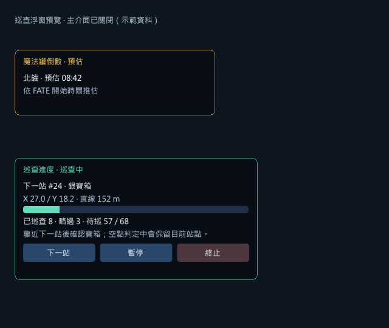

# CrescentCompass｜新月島尋寶羅盤

繁中服 Dalamud API 13 插件，支援寶箱巡查、魔法罐、FATE／CE、探索筆記、標點預設與幻影職業巨集。輸入 `/crescent` 開啟。

## 0.10.21 更新內容 · 2026-10-07

- **精簡安裝包**：安裝與更新僅下載必要執行檔、icon 與授權，約 0.68 MB；完整文件與示範截圖保留在 GitHub 和原始碼包，降低慢速連線的下載逾時風險。功能與玩家設定不變。

- **蘿蔔巡航**：新增「蘿蔔路線 1～25」，依提供圖表巡查，停穩後使用幸運胡蘿蔔並處理新兔子寶箱，需先下坐騎。全點顯示 0／+1／+2 搜尋權重，可排序、插旗與重設；查空歸零、確認拾取後加權，不當作精確機率。BOCCHI 南部使用動態最近鄰，本版依圖上固定順序。[使用與驗證](docs/CARROT_PATROL.md)。

- **魔法罐進島共享時間**：進島最多自動查詢一次 OccultOverlay／Eureka Linker 共用 API，之後由本機倒數與觀測校正；送出副本雜湊、島嶼及資料中心 ID，不上傳本機魔法罐資料。預設開啟，可在魔法罐頁關閉；失敗不自動重試，同島傳送不重查。暫時診斷區新增「重新抓取時間」，手動重試間隔至少 10 秒。詳見 [魔法罐計時說明](docs/POT_FATE_TIMERS.md)。
- **魔法罐 5 分鐘提醒**：下一場南／北罐預估倒數進入 5 分鐘內時，顯示一次彈出通知與個人聊天提示，包含位置方向和預估時間。預設開啟，可在「魔法罐」頁或選單獨立關閉；關閉主介面與倒數浮窗仍會提醒。詳見 [魔法罐計時說明](docs/POT_FATE_TIMERS.md)。

- **BOCCHI 分區巡查**：匯入南部 68 點／7 區段順序與方向性距離表，預設採 BOCCHI 順序，可切回原圖表 1～68。箱點編號、指定起點、已巡查及上次開箱紀錄保留；距離僅為已知站間參考，不替代本機地面尋路。`/crescent route bocchi`／`route chart` 可切換並規劃，不新增自動傳送。[巡查說明](docs/AUTO_PATROL.md)。

- **巡查進度浮窗**：在「巡查」或「設定」勾選「在畫面顯示巡查進度」，主介面關閉後仍可查看下一站與進度，直接按「下一站／暫停或繼續／終止」。預設關閉；直接拖曳標題、放開保存，不需調整模式。完成、終止或尚未巡查時自動隱藏，可與魔法罐倒數同時顯示。詳見 [巡查浮窗說明](docs/PATROL_OVERLAY.md)。
- **魔法罐倒數浮窗**：在「魔法罐」或「設定」勾選「在畫面顯示魔法罐倒數」，主介面關閉後仍顯示下一場南／北罐預估倒數。預設關閉；直接拖曳標題、放開保存，並可按「下一場插旗」標記預估的下一場魔法罐；尚無本場紀錄時停用。詳見 [魔法罐計時說明](docs/POT_FATE_TIMERS.md)。
- **CE 冷卻地圖**：`/crescent ce` 顯示新月島南部原生地圖，15 個 CE 的原生 BOSS／戰鬥圖標、名稱與預估倒數會隨地圖同比例縮放，點擊範圍也同步調整。點選 BOSS 後，可直接點擊 BOSS 或觸發怪座標插旗；支援縮放與拖曳。詳見 [CE 地圖說明](docs/CE_COOLDOWNS.md)。

- **背包整理**：`/crescent loot` 開啟 289 種已記錄寶箱物品清單；支援寵物、樂譜、坐騎等分類、逐項保留／垃圾、搜尋與背包數量。幸運胡蘿蔔、妖金絲與力之魔石已排除。
- **自動處理**：島內自動丟棄、開啟一般 NPC 商店後自動售出；預設全部保留，明確啟動後才處理。詳見 [背包整理說明](docs/LOOT_CLEANUP.md)。
- **連續售出修正**：支援停留在出售或回購列表售出背包垃圾；售出後自動切到回購頁也會繼續，不需切換分頁。
- **未組隊好友顯示**：隱藏玩家加入角色專屬好友快取；先在島外開啟好友名單約 2 秒，確認快取人數後再進島。詳見 [玩家顯示說明](docs/PLAYER_VISIBILITY.md)。

既有功能：

- **自動巡查寶箱**：巡查頁按「啟動自動巡查」或 `/crescent autopatrol`，依南部 68 點路線自動移動、開箱並接續下一站；需相容 API 13 的 vnavmesh。固定路段快取重用，偏離時驗證短接入路徑；3 秒無進展先嘗試跳躍，6 秒仍卡住改查詢貼合網格的側移／後退通路，每站最多恢復 3 次。不再偵測怪物，戰鬥中繼續巡查與嘗試開箱。支援暫停、繼續與終止，脫困失敗保留站點。[使用與驗證狀態](docs/AUTO_PATROL.md)。

- **持續開箱**：2 公尺內立即嘗試，每秒最多一次，取消停穩等待與三次上限，支援地面騎乘。
- **幻影職業浮窗／巨集**：設定中可開啟可拖曳的 13 職業圖示浮窗，點選即可切換，關閉主介面仍可使用。`/crescent job 騎士` 與既有巨集保留；切換與圖示更新不再發送插件聊天提示，狀態留在介面。詳見 [幻影職業說明](docs/PHANTOM_JOBS.md)。
- **快捷列職業圖示**：單行職業巨集的預設 M 自動換成對應圖示；關閉巨集編輯視窗後套用，也可輸入 `/crescent jobicons` 立即更新。
- **標點預覽**：新增俯視圖與力之塔四個王房的場地輪廓示意。

本機版本累計 2,232 項核心檢查通過，包含蘿蔔路線／權重／道具狀態機，以及魔法罐唯讀查詢、手動重試節流與本機觀測優先。「魔法罐」暫時診斷區可查看及複製 HTTP 結果、指紋與拒絕原因；查看或複製不增加請求，只有「重新抓取時間」允許額外查詢。介面亦有離線驗證，CE 地圖位置及圖標已核對繁中客戶端；蘿蔔實際拾取、地形、共享時間命中及其他遊戲互動仍待實測。[詳細更新紀錄](CHANGELOG.md)

## 安裝

在 Dalamud「自訂套件庫」加入：

```text
https://raw.githubusercontent.com/wenwen-ff14/Occult_Crescent_guide_TC/main/pluginmaster.json
```

重新整理插件列表，搜尋 **CrescentCompass** 安裝或更新。地形路線需搭配相容 API 13 的 vnavmesh。

[下載 0.10.21 精簡安裝包](https://github.com/wenwen-ff14/Occult_Crescent_guide_TC/raw/refs/heads/main/packages/CrescentCompass/0.10.21.0.zip) · [使用說明](USER_GUIDE.md) · [職業巨集說明](docs/PHANTOM_JOBS.md) · [建置方式](BUILDING.md)

套件庫版與本機開發版請擇一啟用，避免同名插件重複載入；不需刪除玩家設定。

自動開箱預設關閉，需在「巡查」或「設定」勾選啟用。




AGPL-3.0-or-later。第三方資料與授權見 [NOTICE](third-party/NOTICE.md)。
