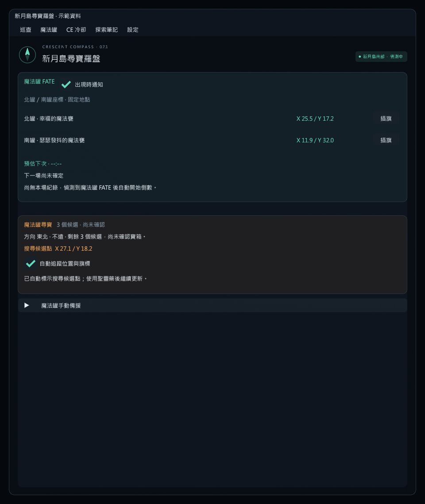
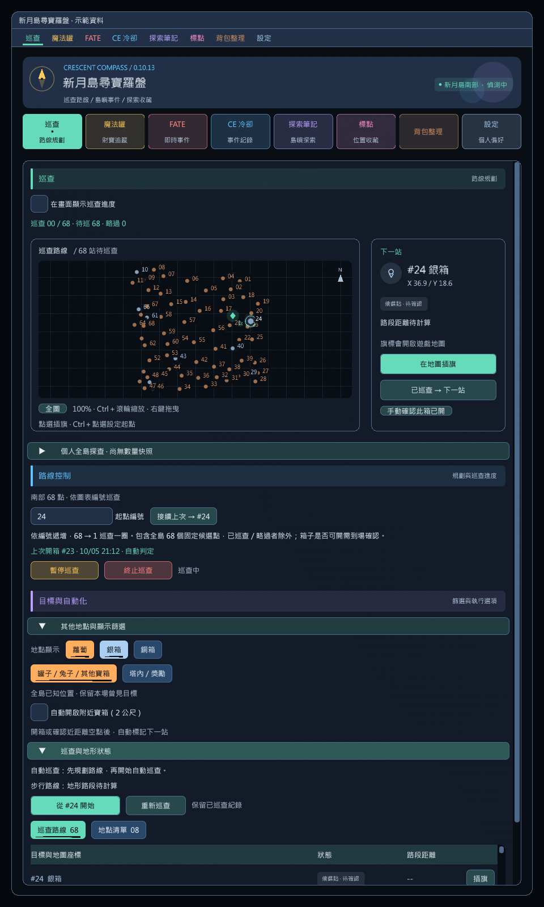

# 使用說明

目前介面使用七色導覽卡片，點選即可切頁；上方下拉選單保留快捷操作。巡查頁優先顯示地圖與下一站，路線及自動化設定在下方。

## 寶箱資料與候選巡查

- 南區固定野外 **68／68** 個箱點與本機繁中場景座標完全一致；新增 **14 個塔內／獎勵箱**，獨立篩選、預設排除。
- 新增兔子金箱、魔法罐金／銀／銅事件寶箱偵測；普通金箱與未知 Treasure 模型也會顯示。
- 新增南區 **80 個**魔法罐候選位置，以及北區 83 筆／82 個不同候選位置。北區未經本機繁中資料驗證。
- 巡查固定使用南部 68 點方案，可指定起點編號。魔法罐使用獨立搜尋流程；取得「指引財寶」後先標**搜尋候選點**，使用聖靈藥後依方向縮小範圍。
- 魔法罐卡片提供候選數、提示、座標與自動同步狀態，另有可收合的手動備援。

**不能把候選清單稱為所有動態寶箱的完整答案。** 查核依據與限制詳見 [寶箱覆蓋稽核](docs/COVERAGE_AUDIT.md)。

## 介面

- 七色功能主題與直接切頁卡片；標題、說明和座標已放大。
- 附近目標摘要、巡查進度條與獨立的「下一站」操作卡片。
- 巡查頁或設定頁可勾選「在畫面顯示巡查進度」；關閉主介面後仍可查看進度並按「下一站／暫停或繼續／終止」。按「調整位置」後拖曳標題，放開保存，再按「完成調整」鎖定位置；完成、終止或尚未巡查時自動隱藏。[巡查浮窗說明](docs/PATROL_OVERLAY.md)
- 路線圖加入網格、北方指示、步行路徑與下一站光圈；密集節點只顯示部分編號，滑鼠移入可查看其餘節點。
- 窄視窗自動改為上下排列，尺寸與間距隨字體縮放。
- 場景文字加上深色底板，同一區域互相重疊的標籤會省略。
- 設定和較長的路線說明可收合。

下圖由實際 ImGui 介面程式離線繪製，使用**示範資料**，不是遊戲內截圖。

## 功能

- 魔法罐下一場預估倒數剩 5 分鐘時，顯示一次彈出通知與個人聊天提示，主介面關閉仍有效；可在魔法罐頁獨立關閉「預估剩 5 分鐘時通知」。

- 每 500 毫秒讀取新月島內已載入的蘿蔔、Treasure 寶箱與已知尋寶事件箱，顯示地圖座標、距離和場景標記。
- 地點清單固定呈現全島已知位置，包含「目前可選取」「曾看見／待確認」；南部 68 點路線另顯示固定候選位置。
- 可篩選蘿蔔、銀箱、銅箱、罐子／兔子／其他箱、塔內／獎勵箱與探索筆記的清單和場景提示，篩選不改動 68 點巡查路線。
- 巡查依南部 68 點編號遞增走一圈，提供編號示意圖、順序清單、每站插旗與下一站旗標；路線模式及物件顯示範圍不需選擇。
- 確認寶箱已開啟或近距離空點後，固定自動標記下一站；也可手動按「已巡查 → 下一站」。空點判定距離不提供調整，內部維持 60 公尺，並檢查步行距離、高差與連續 3 秒無可用箱。
- 支援南部 `1252`、北部 `1346`。只有進入對應區域才讀取遊戲物件。

## 安裝本機版本

1. 將 `dist/CrescentCompass-0.10.14-api13.zip` 解壓縮到固定資料夾；保留 DLL、JSON 與相依 DLL 在一起。重載插件後確認視窗上方版本為 **0.10.14**。自訂套件庫亦提供 0.10.14，安裝方式見 [README](README.md)。
2. 遊戲中使用 `/xlsettings`，到實驗性設定的 **Dev Plugin Locations** 加入解壓後 `CrescentCompass.dll` 的完整路徑。
3. 使用 `/xlplugins`，到 **Dev Tools / Installed Dev Plugins** 啟用「新月島尋寶羅盤」。
4. 啟用相容 API 13 的 vnavmesh，進入新月島南部，輸入 `/crescent`，設定起點編號並按「從 #編號 開始」。導航就緒後計算地面路段；其他偵測與手動旗標功能可獨立使用。
5. 開始巡查後自動標記下一站，也可在下一站卡片按「在地圖插旗」。到達後取得寶箱；開箱或確認近距離空點後自動續行，亦可按「已巡查 → 下一站」手動推進。

也可以直接以 `CrescentCompass/bin/Release/CrescentCompass.dll` 作為開發插件路徑。

原生遊戲地圖一次顯示一個目的地旗標；完整順序顯示於插件清單和路線示意圖。自動下一站固定啟用，暫停巡查時停止換站與自動換旗，按繼續後恢復。

魔法罐的「自動追蹤位置與旗標」預設開啟，能自動標示搜尋候選點、接收方向提示並更新現身寶箱位置。候選點不代表已確認的寶箱。插件不會自動使用道具或移動；自動開箱是獨立的選用設定，預設關閉，詳見 [自動開箱](docs/AUTO_CHESTS.md)。

## 指令

| 指令 | 用途 |
|---|---|
| `/crescent` | 開啟視窗 |
| `/crescent jobs`（或 `job`） | 查看 13 種幻影職業圖標與複製巨集 |
| `/crescent jobicons` | 更新職業巨集的預設 M 為職業圖示；先關閉遊戲巨集編輯視窗 |
| `/crescent job 騎士`（或 `job 1`） | 切換幻影職業，支援放入遊戲巨集；[完整對照](docs/PHANTOM_JOBS.md) |
| `/crescent ce` | 開啟 CE 冷卻頁 |
| `/crescent fate` | 開啟 FATE 頁 |
| `/crescent waymarks`（或 `waymark`） | 開啟標點預設頁 |
| `/crescent pause` | 暫停巡查與自動開箱 |
| `/crescent resume` | 繼續巡查 |
| `/crescent stop` | 終止路線，自動開箱開關獨立保留 |
| `/crescent route` | 從設定的起點開始南部 68 點編號巡查 |
| `/crescent flag` | 在下一站插旗 |
| `/crescent pot` | 在目前魔法罐搜尋點／現身寶箱插旗 |
| `/crescent next` | 將目前站標為已巡查，再插下一站旗標 |
| `/crescent reset` | 保留紀錄，優先續巡上一次尚未巡查點並更新首站旗標 |
| `/crescent clear` | 清除手動／略過紀錄重排；仍排除已確認開啟的箱子 |

## 位置與路線的精確範圍

**即時偵測只涵蓋客戶端已載入的物件。** 未載入區域無法由本機物件表確認刷新；內建候選點和「曾看見」狀態不能保證現在仍有蘿蔔或寶箱。本版沒有跨玩家或雲端位置同步。

內建固定快照在南、北部各含 25 個蘿蔔候選點、8 個銀箱點和 60 個銅箱點；資料可能隨客戶端版本變更。蘿蔔是共用刷新目標，寶箱則依玩家狀態出現。新發現且不在資料庫的點位會加入本次區域紀錄。

**遊戲巡查固定使用南部 68 點編號順序。** vnavmesh 負責計算編號之間的地面路徑，不重新排序；缺少路段也保留該站點，不畫虛構直線。沒有導航時仍可查看編號與手動插旗，但近距離空點自動略過會等待有效步行距離。此方案不宣稱是全域最短路線，危險敵人、解鎖、機關與傳送時間也未列入計算。

同島同分流傳送只暫停偵測與空點計時，保留巡查紀錄、探查數量與路線。確定離島、登出或分流改變時才清空場次資料。單純離開物件載入範圍只會改成「曾看見」，不當作已開箱；地點清單保留本場已知位置，不能保證目標仍存在。巡查保留固定編號，新發現的其他物件不自動加入 68 點路線。原生地圖之前設下的單一旗標可能保留，插件不清除玩家之後手動設定的旗標。

此版使用本機繁中版 `Dalamud 13.0.0.16` 參考檔編譯，已確認 0.6.0 能載入；各功能實際操作驗收狀態見 [版本紀錄](CHANGELOG.md) 與個別功能文件。目標區域尚未在客戶端開放時會保持等待狀態。地形步行路線需要 vnavmesh，無須 Lifestream。

## 背包整理

輸入 /crescent loot 開啟 292 種已記錄開箱物品清單。勾選「丟棄」為垃圾，未勾選為保留；選擇自動丟棄或 NPC 售出後啟動。丟棄限島內，售出需自行開啟一般 NPC 商店。規則也套用原有整疊物品；HQ 等保護物品保留。詳見 [使用方式與資料來源](docs/LOOT_CLEANUP.md)。
