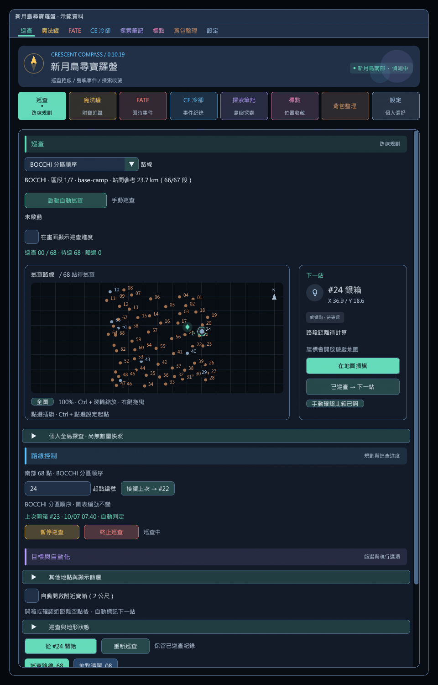

# 自動巡查寶箱

已收錄於 GitHub 自訂套件庫 0.10.21。實際地形通行與互動仍需依下方清單驗收。

## 使用

1. 啟用相容繁中 Dalamud API 13 的 vnavmesh，進入新月島南部，等待地形導航就緒。
2. 在「巡查」頁選擇「BOCCHI 分區順序」（預設）或「原圖表 1～68」，按「啟動自動巡查」或輸入 `/crescent autopatrol`。已有路線時從目前站接續；沒有路線時以設定的圖表起點，依所選順序建立南部 68 點路線。
3. 角色沿地面路徑逐站移動，靠近目前站的可用寶箱後停止移動並嘗試開箱。此巡查會暫時啟用目前站的開箱，不需要另開「自動開啟附近寶箱」，也不改變該獨立設定。
4. 沿用「暫停／繼續／終止巡查」與巡查浮窗控制。`/crescent autopatrol stop` 或「停止自動巡查」只停止自動移動及本次附帶的開箱，保留路線；`/crescent stop` 同時終止路線。

自動巡查每次需手動啟動，不儲存啟動狀態。一圈結束停止，不自動重跑或清除已巡查紀錄。若獨立的附近開箱設定原本已開啟，停止自動巡查後仍依其原有規則運作。

## 固定路徑快取

### BOCCHI 路線資料

0.10.19 匯入上游 commit `400de1ca05a327f016978168560d511e74ff5eed` 的 `SouthHorn/treasure_route.json` 與 `precomputed_treasure_hunt_data.json`，隨套件內嵌，不需安裝 BOCCHI、不新增網路查詢。

- 68 個遊戲資料 ID 一一對應既有繁中場景驗證座標，分成 7 個區段。箱點仍顯示原圖表 #01～#68，不改編號與開箱紀錄；指定起點是原圖表編號，從該點旋轉 BOCCHI 順序一圈。上游原始首點 1804 對應圖表 #21，原始末點 1796 對應 #49；要完全依上游檔案頭尾執行，將起點設為 #21。
- 「接續上次」依當前選用的順序取下一站；例如 BOCCHI 模式 #49 後為 #21，不是 #50。原圖表模式仍為編號加一、#68 接 #01。已巡查與空點紀錄共用。
- 切換順序停止並清空本輪路線，但保留巡查與開箱紀錄，需重新啟動。暫停／繼續、傳送重接與當前路段預算維持原順序。
- `/crescent route bocchi` 或 `/crescent route chart` 可選定順序並規劃／標旗，不會自行移動；自動移動仍使用 `/crescent autopatrol`。
- 匯入距離是有方向性的參考值，僅顯示已知站間合計與「已知／全部路段數」，不含玩家至首站或返回起點。上游節點 1856 只有三筆出發距離，缺值不補直線、不略過箱點；不以此資料開箱、判定空點或送出移動。
- `transitionAfter` 的跨區段傳送策略未啟用，仍逐站地面尋路。沒有引入自動返回營地、傳送、怪物判斷或戰鬥暫停。資料是巡查順序與距離表，不是完整避障軌跡。
- 匯入若有重複／未知箱點、少於 68 點、錯誤區域或無效距離，該模式停止提供，不會偷偷切成另一條路線；可手動選回原圖表順序。

### 路段重用

- 自動巡查啟動只需準備當前路段，不等待整圈 68 段計算；移動後預算下一站路段，預算失敗不影響正在走的路。手動「從指定編號開始」仍可預先計算完整路線。
- 固定站間路段第一次取得後保留在記憶體，路線規劃、自動移動及空點距離檢查共用，不再每站、每秒分別重算。快取命中不排隊等待背景預算。暫停後仍在原折線上時直接接續剩餘路段。
- 偏離原折線 6 公尺內、接點高度差不超過 1.5 公尺時，先查詢短地面接入路徑，成功後保留原路後段；接入超過 18 公尺、端點不符或不可達才重新查詢整段。不同樓層不使用短接入。
- 面板顯示目前快取段數。快取最多 256 段，區分起終點方向，不反轉路徑；不把彎路改成直線。0.10.18 取消 1.5 公尺內直接接回的捷徑，僅原起點或原折線上 0.05 公尺浮點容差內免查詢；即使只偏移半公尺，也需驗證短接入路徑，避免跨過矮牆或擦到牆角。
- 快取只在本次插件載入期間保存。離島、換分流／角色、登出或偵測到 vnavmesh 未就緒時清除；同島同分流傳送保留路段，但落點若不在原路徑附近需另算接入路徑。不跨版本保存舊導航網格。
## 卡住恢復與怪物偵測移除

- 已移除怪物掃描、警戒範圍、等級比較、繞背及聽覺步行；不讀取怪物資料來決定路線，不再切換跑／走模式。舊聽覺標記設定忽略，相關指令已取消。這不包含 CE 地圖的靜態觸發怪資料。
- 參考 BOCCHI 的 `StuckJumpAssist`：3 秒無路程進展先嘗試遊戲原生跳躍，仍保留自己的導航；每 2 秒最多一次，同站持續巡查及其恢復路段合計最多 5 次。跳躍被遊戲拒絕也占用間隔，不反覆送出動作。
- 跳躍中不重新尋路、不確認空點或開箱，落地後才確認進展；跳躍動作本身不重設卡住計時。剩餘路程須縮短超過 1 公尺且水平位移超過 1 公尺才算進展，原地上下跳不算。連續 10 秒未落地會停止並保留箱點。
- 沿路連續 6 秒沒有進展，落地後停止自己的移動並清除當前目標路段快取；固定箱點順序保持不變。
- 先查詢一次全新地面路徑；若仍穿過目前前進方向的卡點鄰域，拒絕重播，再查詢側移與後退候選。候選只作為尋路目的地，不直接送去移動；兩段使用實際網格回傳端點相接，保留所有網格轉角。
- 每次最多 9 次尋路查詢、14 秒，參考 BOCCHI 的 8 公尺側移，候選側向距離依第 1／2／3 次恢復為 8／10／12 公尺，交替優先嘗試的方向。候選先透過可用的 `Query.Mesh.NearestPoint`／`PointOnFloor` 貼回網格，拒絕超出水平或高度 3 公尺的貼點；舊版缺少這些介面時，仍須透過完整尋路驗證原候選。
- 拒絕無效座標、不完整端點、重新通過卡點及過長繞路；臨時恢復路徑不寫入快取。BOCCHI 的北部特定箱點繞障中繼點不套用到南部 68 點路線，也不採用未驗證的直線收尾。
- 每個箱點最多 3 次恢復；找不到替代通路、超時或仍無進展便停止並保留站點，不自動略過、不無限重試。恢復尋路期間暫停提前空點確認。手動取消或其他導航接手不會觸發搶回控制。

不再預防引怪；0.10.17 起進入戰鬥也繼續巡查，不重算或中斷正在走的路段。戰鬥中照常確認空點與嘗試開箱，仍需遊戲接受互動才算開啟。卡住恢復依幾何與移動進展判斷，不保證能通過導航網格本身缺損的地形；必要時需手動脫困。

## 接續與停止

- 確認寶箱開啟後沿用既有巡查紀錄接續下一站。互動請求與到達座標本身不會寫成已開箱。
- 空點可在抵達前確認：同層 20 公尺內允許確認；20 至 60 公尺需另有距該箱點 25 公尺內、同層且已載入的一般銅／銀箱作為區域載入證據。地面可通行距離也不能超過確認範圍；過長繞路、不同樓層、缺少路徑、卡住恢復中或遊戲忙碌時不確認。
- 提前空點需連續三次成功掃描且至少 1 秒沒有可用／開啟中的寶箱；新箱出現、暫停、換站或超過 1 秒的掃描斷點會重置。單次物件消失不直接換站。略過不代表已領取，日後重新觀測到可用箱會解除略過狀態。手動巡查維持原本 3 秒確認規則。
- 巡查開箱前停止並確認位置穩定 250 毫秒，每 500 毫秒最多互動一次；讀條與開啟動畫不重複互動。原生開啟／淡出狀態或戰利品清單為成功依據，互動請求或物件消失本身不算成功。獨立附近開箱維持原本每秒一次的行為。
- 讀條、互動、過場、飛行及乘坐他人坐騎時暫停移動；同島同分流傳送後從落點重新尋路。手動暫停會持續保留，需按「繼續」才恢復。
- 魔法罐尋寶或 FATE 標點取得優先權時暫停巡查，不會自動走向事件。事件結束或解除其優先權後接續原路線。
- 無完整路徑、vnavmesh 不可用、移動被手動中止、其他導航接手、到站 20 秒仍未完成開箱或空點確認時，停止自動巡查並暫停路線。站點保留，可處理原因後重新啟動。
- 倒地、離島、換分流、換角色、登出或插件卸載後停止。重新登入不會自行移動。

只巡查南部圖表中的一般銅／銀箱，不包含蘿蔔、塔內、探索筆記、魔法罐或兔子搜尋路線。沒有自動戰鬥、使用道具、傳送、上／下坐騎或穿牆；可達性仍取決於導航網格與遊戲地形。

## 導航介面

以 vnavmesh 官方 [IPCProvider.cs](https://github.com/awgil/ffxiv_navmesh/blob/master/vnavmesh/IPCProvider.cs) 與 [FollowPath.cs](https://github.com/awgil/ffxiv_navmesh/blob/master/vnavmesh/Movement/FollowPath.cs) 的公開介面為依據，執行時檢查必要 IPC 是否存在。全部移動操作在 Framework 執行緒執行。

固定路線規劃取得的原始路點會進入共用快取；移動及距離檢查優先使用快取或當前移動路徑。未命中與卡住恢復的替代路段都使用 `Nav.PathfindCancelable`（舊版退回 `Nav.Pathfind`），不依賴舊版可能缺少的 `Nav.PathfindAvoid`。以 `Path.MoveTo` 送出地面路點，固定 `fly=false`。驗證座標、起點及終點距離；不在路徑尾端補上未查證的直線。取消只影響本次查詢，過時結果不能啟動移動。舊版 IPC 不支援取消其後端計算時，只放棄本次結果，不呼叫全域取消或重建。

移動前檢查 `SimpleMove.PathfindInProgress`、`Path.ListWaypoints` 與 `Path.GetMovementAllowed`。停止時只有剩餘路徑是本功能送出路徑的完整尾段才呼叫 `Path.Stop`；不同路徑不停止。IPC 沒有獨立的導航擁有者代碼，因此無法區分其他工具恰好送出完全相同路徑的情況。不改變 vnavmesh 的移動允許、鏡頭、容差或手動輸入取消設定。

## 驗證狀態

0.10.19：2,072 項核心檢查通過；BOCCHI 全部 68 起點、上次開箱接續、分區、距離方向及缺值處理、原有箱點紀錄共用、完整性驗證、缺路不以參考距離補直線、重複路段快取均有回歸。路線選單雙向切換與無效資料禁用、窄版／150% 字體離線預覽通過。尚未遊戲內驗收。

0.10.18：1,765 項核心檢查通過，新增跳躍限頻／總量、落地與水平進展、戰鬥中跳躍、空中停止與外部導航、空中到站、貼網格端點、近距離快取接入及尋路期間起點變更回歸。API 13 Release 編譯零警告／錯誤；巡查窄版、150% 字體及控制操作的離線預覽通過，尚未遊戲內驗收。

本機繁中客戶端 `2026.09.14.0000.0000` 離線核對：`GeneralAction` 2 為「跳躍」，`ActionType.GeneralAction` 為 5；SDK `ActionManager.Instance` 與 `UseAction` 特徵碼在 `.text` 各唯一匹配，位置 RVA `A72708`／`89986E`。這是特徵碼位置，不是直接呼叫位址；實際使用 SDK 解析。客戶端 SHA256：`837B9E2893D45D22C1DDE3D1A134AF2749E0C9FFF6E2EF7246B84860F855E247`。可用 `tools/PatrolAudit --jump <exe> <sqpack>` 重現；工具不連接遊戲程序。這些檢查不代表所有障礙物均能跳過。

0.10.17：1,709 項核心檢查通過，新增戰鬥中啟動與持續移動、不重算路段、卡住恢復、停穩後開箱、空點換站及停止巡查後恢復獨立開箱限制的回歸。手動暫停、倒地、讀條與過場等其他限制不變。尚未遊戲內驗收。

0.10.16：1,680 項核心檢查通過，API 13 Release 編譯零警告／錯誤，巡查與魔法罐診斷的離線 UI 操作、窄版及 150% 字體預覽通過。回歸涵蓋一般移動與快取、6 秒無進展、替代路徑、失敗方向拒絕、兩側不可達、有限嘗試、端點驗證、取消、逾時、外部導航接手及提前空點／開箱。怪物與步行測試隨功能移除。

尚未操控實際遊戲角色驗收。實測需確認卡住後的側移／後退、首站移動、開箱換站、空點、戰鬥持續巡查／傳送暫停、手動中止、背包滿及卸載停止。導航網格的可達性與物件載入邊界仍需遊戲內確認。
