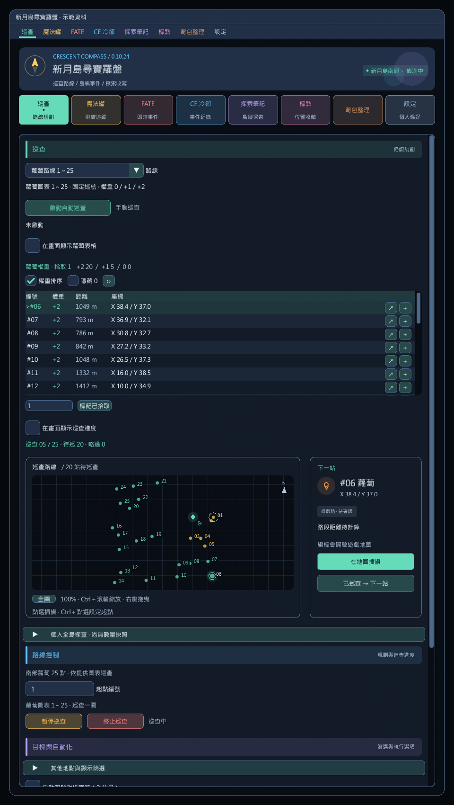

# 蘿蔔巡航與搜尋權重

0.10.21：巡查頁「路線」選擇「蘿蔔路線 1～25」，備妥幸運胡蘿蔔並下坐騎，再按「啟動自動巡查」。需要相容 API 13 的 vnavmesh；不會在登入時自行啟動。

## 路線

依使用者提供的圖上編號走固定 25 點，保留原資料庫 ID 與座標。任選起點旋轉一圈，例如 #5～25、#1～4；完成一圈停止。

| 圖上編號 | 原資料庫蘿蔔 ID |
|---|---|
| 1～5 | 22、11、1、10、21 |
| 6～10 | 8、9、3、4、7 |
| 11～15 | 12、5、24、6、13 |
| 16～20 | 20、17、2、14、19 |
| 21～25 | 18、15、23、25、16 |

`/crescent route carrot` 選擇並規劃，`/crescent autopatrol` 才啟動移動。切換路線停止舊巡查，寶箱起點及開箱紀錄獨立保留。「重新巡查」重建全部 25 點並保留權重；離島、換分流或換角色才清除本場權重。

圖片只指定點位及順序，紅線不是可通行保證。移動沿用地面尋路、路段快取、下一段預算及卡住恢復；不新增返回或傳送。無怪物偵測，戰鬥本身不停止；讀條、倒地、過場、外部導航及手動暫停保護不變。

## 拾取與空點

1. 看見蘿蔔物件 `2010139`，靠近 2 公尺並停穩後，使用幸運胡蘿蔔 `48096`。地面物件不必可選取，不直接對它呼叫開箱互動。
2. 背包數量減少一個才加權，原生呼叫或讀條不算成功。背包暫時不可讀時等待、不重送；使用失敗最多三次，每次至少間隔 5 秒。背包異常、觀測中斷、使用或寶箱等待逾時時停止並保留站點。
3. 等待新出現的兔子黃金財寶箱 `2012936`，用既有開箱流程處理；不把原有寶箱當成新獎勵。確認已開，或互動後近距離連續觀測到消失，才完成本站。同點仍有另一個蘿蔔物件時繼續處理。
4. 三維距離及剩餘地面路程皆在 6 公尺內，至少 1.5 秒、三次新觀測未見蘿蔔或兔子箱，才將空點歸零並略過。不同樓層或導航未知不判空。

坐騎上不使用蘿蔔，也不自動下坐騎。沒有道具時停止。戰鬥中遊戲可能拒絕道具或開箱，插件不繞過遊戲限制。

「手動確認本點已拾取」限目前站附近、需再次確認蘿蔔與寶箱已處理；已自動記過本次消耗則不重複加權。只按「已巡查 → 下一站」不增加拾取數或改動權重。這些操作不寫入寶箱的最後開箱紀錄。

## 搜尋權重

依使用者提出的「同場最多兩根、拾取立即重生」模型，這是**本機搜尋優先度，不是精確機率**：

- 初始全點 **+2**；近距離查空後該點為 **0**。
- 確認拾取一根，先把拾取點歸零，再全點加一，上限 **+2**。
- 範例：#1～4 查空、#5 拾取後，#1～5 為 **+1**，未查過的 #6～25 為 **+2**。

清單保留全部 25 點，可依權重或編號排序、逐點插旗，地圖也顯示權重顏色。清單排序不改固定巡航。「重設權重」回到全 +2、清除拾取數但不更動路線。權重不跨場次保存，不新增雲端或跨玩家同步。

無法掌握視野外其他玩家的拾取與刷新；同點可能有兩根，這些數字也不是互斥機率。0 只表示最近一次查空，不能保證持續無蘿蔔，紀錄過期時可重設。

## BOCCHI 研究

2026-10-07 核對 [CarrotHunterService.cs](https://github.com/OhKannaDuh/BOCCHI/blob/400de1ca05a327f016978168560d511e74ff5eed/BOCCHI.Treasure/Services/CarrotHunterService.cs)，commit `400de1ca05a327f016978168560d511e74ff5eed`：BOCCHI 有蘿蔔巡航，但南部採動態最近鄰、附近群組偏好與看見蘿蔔時轉向，並非與本圖相同的固定 1～25 路線檔。

上游另有返回／乙太之光轉移、北部 Middle → NW → NE 分區與特定繞行點；本版不新增傳送，也不把北部座標套到南部。參考道具使用、消耗確認、等待兔子箱與同點多根的概念，以 API 13 獨立實作，未複製上游程式碼或新增執行期依賴。詳見 [NOTICE](../third-party/NOTICE.md)。

## 驗證狀態

2,232 項核心檢查通過：全部起點旋轉、圖上 ID 對應、權重範例、重複事件、背包延遲、道具／寶箱流程、空點與路線類型隔離。離線 UI 涵蓋一般、窄版、短視窗、150% 字體、切換、排序、重設、手動確認、過期確認及島外停用；既有 BOCCHI／寶箱巡查介面也重跑。

本機繁中資料確認 `48096` 為「幸運胡蘿蔔」、ItemAction `2738`，`2012936` 為「黃金財寶箱」。SDK `AgentInventoryContext.UseItem` 特徵碼在客戶端恰有一個匹配，並非實際呼叫成功的證明。**尚未操控遊戲角色實測**；道具使用、兔子箱載入、戰鬥／坐騎及地形仍待 [遊戲驗收](IN_GAME_CHECKS.md)。

