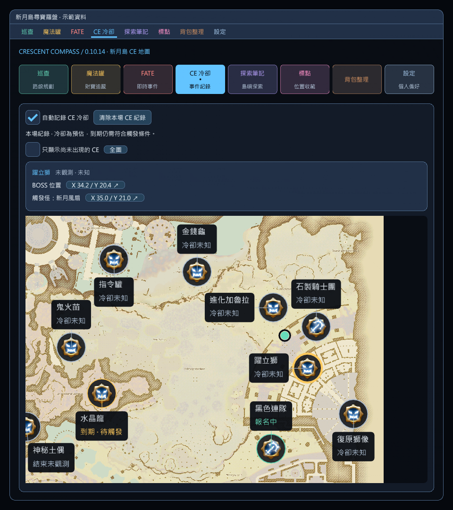

# CE 冷卻地圖與觸發條件（0.10.10）

`/crescent` → 頂部 **CE 冷卻 → 查看冷卻與觸發條件**，或直接輸入 `/crescent ce`。預設自動記錄新月島南部 15 個危命任務；視窗關閉或切換頁面仍會掃描。北部尚未核對，不套用南部資料。一般 FATE、魔法罐與塔不列入這 15 個 CE。

入口不受所在區域限制。尚未上島或位於北部時，仍顯示南部清單及說明，狀態為未知，不沿用其他場次倒數。若完全沒有入口，核對視窗頂端的實際版本；開發插件需更新 Dev Plugin Locations 指向的 DLL，重新載入舊檔案仍會是舊版。

## 地圖與插旗

0.10.7 將表格換成南部原生地圖。15 個 CE 的固定位置常駐顯示原生 BOSS／戰鬥符號、名稱及預估倒數；有圖標不代表事件已出現。未知顯示「冷卻未知」，到期顯示「到期 · 待觸發」，進行中顯示報名／準備／戰鬥狀態。

- 點選圖標或名稱，地圖上方顯示該 CE 的狀態與觸發條件。
- 點擊「BOSS 位置」座標可在遊戲地圖插旗。六個打怪 CE 另外提供觸發怪座標，點擊旗標會落在怪物活動區域，不是 BOSS 場地。
- Ctrl＋滾輪以滑鼠位置縮放，左鍵／右鍵／中鍵拖曳；「全圖」或雙擊空白處還原。0.10.10 起，BOSS 圖標、名稱、狀態及倒數隨地圖同比例縮放，標籤背景、間距與點擊範圍一起調整。標籤避開圖標並盡量減少重疊。
- 勾選「只顯示尚未出現的 CE」只保留本次分流尚未觀測到出現的事件；已觀測者即使冷卻到期也排除。未觀測不代表伺服器從未刷新，換分流或清除紀錄後重新累計。
- 拖曳不會選取 BOSS 或插旗；單擊在放開滑鼠時選取。拖曳可持續到地圖邊界外，點選仍能在拖曳後正常使用。
- 島外、北部及傳送載入時仍可查看南部地圖，但不能插旗。地圖與圖標由遊戲資源讀取，不另行散布素材。

地圖 967：`o6b1/01`，SizeFactor 100，OffsetX/Y 均為 0。位置由本機 `DynamicEvent` 第 5 欄連結 `planmap.lgb`，圖標由事件類型連結 `DynamicEventType`：一般 BOSS 63909，黑色連隊與石製騎士團 63911。15 個位置與名稱已逐項驗證，見 [本機地圖查核](audit/ce-map.txt)。

可執行 `GameDataAudit <sqpack> --ce-map` 重新核對；僅供預覽的匯出素材位於忽略追蹤的 `artifacts/ce-map-textures`，不加入發佈包。

## 計時依據

- 讀取 API 13 `PublicContentOccultCrescent.DynamicEventContainer.Events`，每 500 毫秒觀測一次。CE 使用自己的 `DynamicEventId`，不是一般 `IFateTable` 的 FATE 編號。
- 顯示報名、準備、戰鬥階段。曾觀測戰鬥後，連續兩秒確認同一事件為 `Inactive`，才將第一次不活躍時間記為「上次觀測結束」。100% 進度、只看到空表、報名取消都不直接建立冷卻。
- 六個打怪觸發 CE 以觀測結束 + 60 分鐘估算，其餘九個以 + 120 分鐘估算。這是本功能採用的社群近似模型，不是讀取伺服器冷卻欄位；也無法由事件停止判斷勝敗。失敗場次的再觸發規則需另外實測。
- 到期顯示「預估冷卻已到期／等待實際觸發」，不宣告刷新、不自動另開新週期。再次實際看見報名／戰鬥時，取代前次冷卻。
- 新上島沒有本場紀錄的 CE 顯示「未觀測 · 未知」，不把未出現當作可觸發。曾看見但錯過結束，顯示「結束未觀測」。

模型來源：[N.A. Field Operations 南部 CE 攻略](https://lynn-lizard.github.io/crescent/southhorn/#critical-encounters)，查核 2026-10-01。該頁記錄隨機 CE 約 120 分鐘、打怪 CE 約 60 分鐘；未提供繁中服的伺服器計時保證，因此本版明示「預估」，以觀測結束作為可解釋的本地起算點。

## 觸發條件

六種打怪觸發 CE 顯示下列怪物與大致活動區域。條件與位置依 [N.A. Field Operations 玩家催生資料](https://lynn-lizard.github.io/crescent/southhorn/#player-spawned-ces)，2026-10-01 查核。繁中怪物名稱另外以本機 `BNpcName` 核對，英文以 [XIVAPI BNpcName](https://v2.xivapi.com/api/sheet/BNpcName?rows=13879,13875,13895,13913,13876,13884&fields=Singular&language=en) 對照相同列 ID。

| CE | 指定怪物 | 大致位置 | BNpcName ID／英文對照 |
|---|---|---|---|
| 奪心魔 | 新月鬼魚 | X 26 / Y 33 | 13879 · Crescent Monk |
| 回廊惡魔 | 新月墨漬 | X 14 / Y 35 | 13875 · Crescent Inkstain |
| 神秘土偶 | 新月比布羅斯 | X 5 / Y 25 | 13895 · Crescent Byblos |
| 尼姆瓣齒鯊 | 新月小瓣齒鯊 | X 19 / Y 6 | 13913 · Crescent Petalodite |
| 躍立獅 | 新月風扇 | X 35 / Y 21 | 13876 · Crescent Fan |
| 進化加魯拉 | 新月加魯拉 | X 31 / Y 8 | 13884 · Crescent Garula |

其他九種 CE 標示隨時間自動出現、等待系統刷新。這是條件說明，並未讀取伺服器的擊殺計數或佇列；不填入未確認的擊殺門檻。座標是怪物活動區域參考，不是 CE 本體的出現座標，冷卻到期也不代表立刻出現。可用 `GameDataAudit --ce-triggers` 重查本機名稱，結果保存於 [名稱查核](audit/ce-trigger-names.txt)。

## 場次與中斷

同島同分流傳送保留已確認的結束時間與冷卻。傳送、缺少事件、空容器、讀取失敗、超過三秒未更新、時鐘倒退會中斷連續觀測；不將讀取恢復時間誤當成結束時間。若恢復後仍能看到戰鬥，從此重新觀測結束。沒有看到戰鬥結束，便不補造倒數。

離島、換分流、登出、換角色、插件重載或按「清除本場 CE 紀錄」會清除這份暫存；不跨島保存冷卻。關閉記錄開關會保留既有結束時間，但不記錄新事件。此資料不是伺服器提供的永久島嶼識別紀錄。

## 繁中資料核對

本機 TC `DynamicEvent.exh` 的名稱為 **第 11 欄、string、offset 0**。不使用不同版本 Lumina 產生的欄位索引猜名稱。已從實際表頭與原始列核對下列 15 筆繁中名稱；執行期使用固定已核對名稱與 SDK 的事件狀態欄位。

| DynamicEvent ID | 名稱 | 觸發分類／預估冷卻 |
|---|---|---|
| 33 | 腦髓愛好者——奪心魔 | 打怪／60 分鐘 |
| 34 | 黑色連隊 | 自動／120 分鐘 |
| 35 | 憤怒的人造人——新月狂戰士 | 自動／120 分鐘 |
| 36 | 潛影撕裂者——死亡厲爪 | 自動／120 分鐘 |
| 37 | 掙脫封印的大妖異——回廊惡魔 | 打怪／60 分鐘 |
| 38 | 擬造使魔——水晶龍 | 自動／120 分鐘 |
| 39 | 雙極的造物——神秘土偶 | 打怪／60 分鐘 |
| 40 | 石製騎士團 | 自動／120 分鐘 |
| 41 | 傳說中的鯊魚——尼姆瓣齒鯊 | 打怪／60 分鐘 |
| 42 | 雙足獅人——躍立獅 | 打怪／60 分鐘 |
| 43 | 防衛指令 | 自動／120 分鐘 |
| 44 | 厭鳥巨獸——進化加魯拉 | 打怪／60 分鐘 |
| 45 | 販賣詛咒的商販——金錢龜 | 自動／120 分鐘 |
| 46 | 城塞守衛——復原獅像 | 自動／120 分鐘 |
| 47 | 昏暗妖魂——鬼火苗 | 自動／120 分鐘 |

SDK 狀態核對為 `Inactive=0, Register=1, Warmup=2, Battle=3`。讀取器要求南部、正確 PublicContent director、`StateLoaded`、有效 ID／狀態／進度與不重複列；不使用複製的記憶體 offset，不寫入遊戲記憶體。

參考：[FFXIVClientStructs 事件結構](https://github.com/aers/FFXIVClientStructs/blob/main/FFXIVClientStructs/FFXIV/Client/Game/InstanceContent/DynamicEventContainer.cs)、[BOCCHI 已固定版本的 CE 讀取方式](https://github.com/OhKannaDuh/BOCCHI/blob/aa4f6efce52d78c3c3992e88d2bcd7bb218904f2/BOCCHI.World/Services/CriticalEncounterRepository.cs)。實際編譯依本機繁中 API 13 SDK，不直接替換成國際版最新結構。

## 選單分類

| 選單 | 內容 |
|---|---|
| 巡查 | 蘿蔔、寶箱篩選、圖表起點、地形順序、暫停／接續／終止、路線圖與清單 |
| 魔法罐 | FATE 通知與倒數、北罐／南罐座標、自動尋寶旗標與手動備援 |
| FATE | 所有一般 FATE 清單、出現自動標點、解除本次標點、手動插旗 |
| CE 冷卻 | 南部原生地圖、15 個 CE 圖標與倒數、觸發怪座標插旗、只看尚未出現與清除 CE 紀錄 |
| 探索筆記 | 島上地點、未探索篩選、插旗、納入巡查／場景提示開關 |
| 設定 | 隱藏其他玩家、場景提示、清除巡查紀錄、資料與路線說明 |

使用原生頂部下拉選單。各選單的第一項開啟對應功能頁，分隔線下方提供常用操作或設定開關。只切換頁面不變更追蹤開關或路線；各頁有獨立捲動位置，頂部選單維持可見。Dalamud 的設定按鈕直接開啟「設定」頁。

## 驗證與限制

核心驗證涵蓋首次進島、三種進行階段、60／120 分鐘分類、結束確認、抖動、重複輪詢、倒數到期、真正再次出現、關閉／暫停、空表／缺列／錯誤資料／重複 ID、漏看結束、時鐘倒退、換分流、北部排除與清除紀錄。離線 ImGui 測試包含六個選單及其第一個子項實際點擊、切頁不呼叫功能操作、島外／北部／首次上島仍列出 15 個 CE，以及 Ctrl＋滾輪仍縮放地圖。新增三種滑鼠按鍵拖曳、從 BOSS 圖標開始拖曳、拖出地圖、單擊微抖動、篩選空結果／切換／觀測暫停／清除紀錄的離線互動測試。

預覽使用示範資料。遊戲內 native 事件生命週期、戰鬥失敗與繁中服實際重生間隔尚待驗收；未宣稱已在遊戲中完成測試。

0.10.7 驗證包括六個觸發怪座標逐項點擊、BOSS 座標點擊、島外／北部／傳送期間停用、Ctrl＋滾輪不捲動外層視窗，以及寬版、窄版與 150% 字體。1219 項核心檢查通過；原生插旗 API 的遊戲內結果仍待實測。

