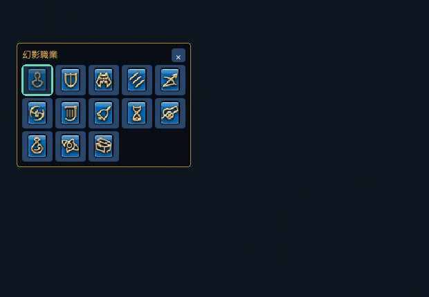

# 幻影職業與巨集

0.9.7，繁中 Dalamud API 13。輸入 `/crescent jobs`，或「設定 → 幻影職業／巨集」，查看遊戲圖標、目前職業及指令。按「複製巨集」後貼入遊戲巨集，關閉編輯視窗，再拖到快捷列；也可按「切換職業」。

```text
/crescent job 騎士
```

接受繁中完整名稱、去掉「輔助」的名稱、「幻影」前綴、英文全名／去掉 Phantom 的英文名稱或編號。英文不分大小寫，例如 `/crescent job "Time Mage"`。不接受模糊縮寫；未知名稱不會猜測。

| 編號 | 繁中職業 | 英文 | 巨集 |
|---|---|---|---|
| 0 | 輔助自由人 | Freelancer | `/crescent job 0` |
| 1 | 輔助騎士 | Knight | `/crescent job 1` |
| 2 | 輔助狂戰士 | Berserker | `/crescent job 2` |
| 3 | 輔助武僧 | Monk | `/crescent job 3` |
| 4 | 輔助獵人 | Ranger | `/crescent job 4` |
| 5 | 輔助武士 | Samurai | `/crescent job 5` |
| 6 | 輔助吟遊詩人 | Bard | `/crescent job 6` |
| 7 | 輔助風水士 | Geomancer | `/crescent job 7` |
| 8 | 輔助時魔道士 | Time Mage | `/crescent job 8` |
| 9 | 輔助砲擊士 | Cannoneer | `/crescent job 9` |
| 10 | 輔助藥劑師 | Chemist | `/crescent job 10` |
| 11 | 輔助預言士 | Oracle | `/crescent job 11` |
| 12 | 輔助盜賊 | Thief | `/crescent job 12` |

插件需啟用，角色需在新月島、非戰鬥且可操作。職業解鎖、冷卻等限制由遊戲判定。每秒最多送出一次，送出後最多等待 3 秒確認；沒有收到資料確認會在介面提示檢查遊戲訊息，不會自動反覆切換。登出、傳送、換分流或換角色取消等待。

## 幻影職業浮窗

在「設定」或「幻影職業／巨集」勾選「在畫面顯示幻影職業」，也可從設定選單切換。預設關閉，開關與位置會保存；關閉主介面後仍可操作。拖曳標題移動，右上角的關閉按鈕會關閉並保存顯示設定。

浮窗以緊湊圖示排列全部 13 種職業，點擊圖示沿用既有手動切換流程，不需建立巨集。綠色外框表示遊戲目前回報的職業，滑鼠提示顯示名稱與切換結果；不會把已送出請求誤當成成功。圖示尚未載入時以職業文字提示代替，不影響切換。

只在新月島顯示；離島、傳送、過場、合照與隱藏遊戲介面時隱藏。戰鬥、倒地、互動、資料未就緒或等待上一次結果時停用切換，點擊目前職業不送出請求。按鈕不會拖動視窗；超出畫面的舊位置會限制回可見範圍。

職業切換、未知職業與巨集圖示更新不再寫入插件聊天系統提示，診斷保留在介面與 Dalamud 錯誤記錄。此變更不攔截遊戲原生的解鎖或冷卻錯誤訊息。



## 快捷列的職業圖示

保留單行指令，例如 `/crescent job 1`，並使用預設 **M** 圖示。關閉遊戲巨集編輯視窗後，插件每 2 秒檢查一次，將 M 換成對應的職業圖示、保存巨集並刷新既有快捷列。個人與共用巨集都支援，離島後也能更新圖示。

既有的單行職業巨集也適用，不必重新建立。若要立即檢查，可按「更新快捷列圖示」或輸入：

```text
/crescent jobicons
```

只更新預設 M 或上述 13 種職業圖示；修改巨集內職業後，原有職業圖示會跟著更新。自訂圖示、含 `/micon` 或其他多行指令的巨集會略過。保留名稱、文字與快捷列位置。編輯巨集、戰鬥、互動、傳送或角色資料未載入時暫停；有實際圖示變更才請求儲存。錯誤時停止自動更新，可用更新按鈕重試。

圖示使用遊戲的職業狀態圖標。[官方 `/macroicon` 類別](https://na.finalfantasyxiv.com/lodestone/playguide/db/text_command/e6e219e1adc/)沒有狀態圖示類別，因此使用插件的巨集圖示更新功能，不需另加 `/micon`。


## 相容性與驗證

`tools/PhantomAudit` 以本機繁中客戶端 **2026.09.14.0000.0000** 唯讀核對 `MKDSupportJob` 的 0～12 列與 `Status` 的 4242、4358～4369 列：對應圖標為 216871～216883。圖標檔在遊戲安裝中，插件不散布獨立材質。

SDK 的 `AgentMKDSupportJobList.ChangeSupportJob(byte)` signature 唯一匹配 RVA `0xF9EAA0`，呼叫原生職業切換流程 `0x166EFE0`。程式只呼叫 SDK 方法，不改寫職業記憶體，並以 `PublicContentOccultCrescent.State.CurrentSupportJob` 確認結果。執行檔 SHA256：`837B9E2893D45D22C1DDE3D1A134AF2749E0C9FFF6E2EF7246B84860F855E247`。

參考 [FFXIVClientStructs AgentMKDSupportJobList](https://github.com/aers/FFXIVClientStructs/blob/main/FFXIVClientStructs/FFXIV/Client/UI/Agent/AgentMKDSupportJobList.cs)；實際編譯與 signature 使用本機繁中 SDK。

巨集圖示使用 SDK 的 `Macro.SetIcon`、`SetSavePendingFlag`、`SaveFile` 與 `ReloadMacroSlots`；前者同步更新圖示與 MacroIcon 列索引，後者只刷新對應巨集的快捷列。使用本機 SDK 欄位與方法，不加入手寫記憶體位移。`MacroIcon` 第 0 列確認預設 M 為 66001；四個 member-function signature 唯一匹配，記錄見 [巨集圖示核對](audit/phantom-macro-icons.txt)。

核心檢查涵蓋所有名稱／編號、未知輸入、目前職業、狀態阻擋、節流、確認／逾時、原生拒絕與轉場，以及 M 圖示對應、自訂圖示保留、多行巨集排除與避免重複儲存。另驗證取消聊天提示後仍保留介面診斷。ImGui 互動測試確認更新圖示、複製與切換操作彼此獨立；浮窗涵蓋全部圖示、自由人編號 0、目前職業不重送、狀態阻擋、點擊途中進入戰鬥、關閉、拖曳保存、拖曳中隱藏、畫面邊界、材質缺失、窄版與 150% 字體，以及島內外兩個設定頁的獨立開關。

遊戲內待驗收：分別以輸入指令、巨集、清單與浮窗圖示切換已解鎖職業，確認原生面板及插件目前職業一致，且插件不再送出聊天提示；再測未解鎖、戰鬥、冷卻與傳送情境。關閉主介面後仍能操作浮窗，關閉／重載後開關與位置保持。離線測試不能確認伺服器實際接受切換。

圖示待驗收：各建立一個個人／共用的單行巨集，拖到普通快捷列及十字快捷列，關閉編輯視窗確認 M 更新；重新登入確認保存。編輯職業指令後確認圖示跟隨；自訂圖示與多行巨集保持原樣。此更新已完成離線核對，尚未在遊戲內驗證快捷列刷新與保存結果。
