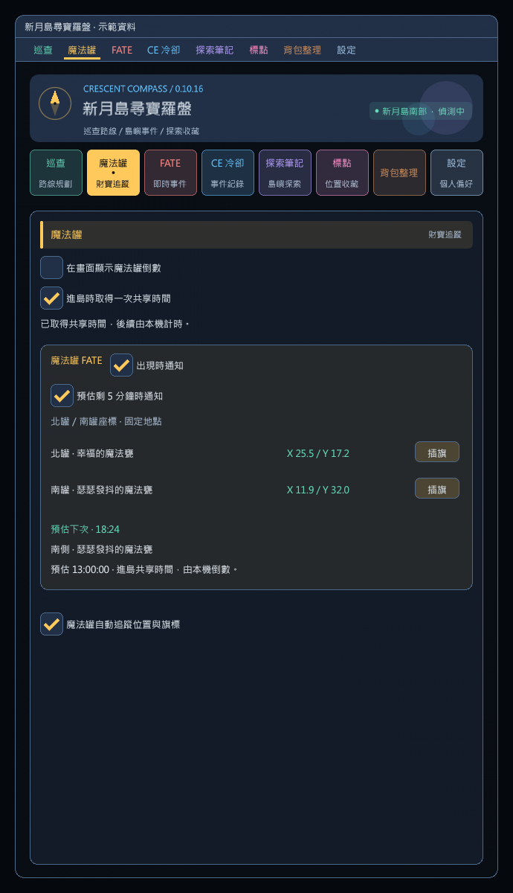
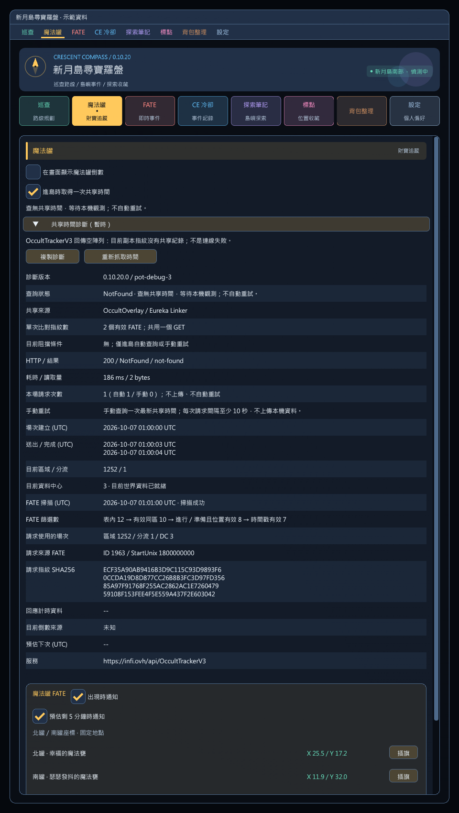

# 魔法罐 FATE 地點、通知與預估倒數（0.10.20）

「魔法罐」頁的「魔法罐 FATE」卡片顯示目前事件、進度、剩餘時間，以及下一場的預估倒數。可按「標記 FATE 地點」標示目前偵測到的實際事件位置；出現通知不會自動覆蓋尋寶旗標。

## 進島一次性共享時間（本機新增）

「魔法罐」頁的「進島時取得一次共享時間」預設開啟，島外也能設定。每次確認進島後，最多自動向 OccultOverlay／Eureka Linker 共用的 `https://infi.ovh/api/OccultTrackerV3` 發出一次 GET，取得本場最近一次魔法罐的開始時間，再由本機計算剩餘時間；之後不輪詢、不上傳觀測、不接收持續同步的 IPC。0.10.20 另提供暫時的手動重試按鈕，只有明確點擊才增加一次查詢機會。

- 傳送島嶼及資料中心 ID，並將目前有效的 FATE ID／開始時間／資料中心 ID 以三個 little-endian Int32 組合成 SHA-256。最多 16 個精確指紋共用單次 GET 的 `last_fate=in.(...)` 條件，不模糊猜測時間、不按每個指紋分次連線。不上傳角色名稱、Content ID、座標、安裝識別或魔法罐觀測紀錄；服務仍會看到連線 IP。這不是完全離線功能。
- 進島後等待至少 2 秒，至多 1 分鐘供副本資料就緒。已有本機魔法罐計時就不查詢；無法建立指紋則只等待本機觀測。單次請求最多 10 秒，查無資料、失敗或資料無效均不自動重試。
- 只接受符合本次副本雜湊、資料中心、島嶼及魔法罐 ID，且開始時間在過去 30 分鐘內的回應。過期資料不向後外推週期；沒有有效共享或本機紀錄時維持 `--:--`。
- 倒數會註明「進島共享時間 · 本機倒數」。共享資料不是實際出現證據，不觸發「已出現」通知；可沿用 5 分鐘提醒與下一場插旗。取得實際本機觀測後，以本機資料校正，不再連網。
- 同島同分流的傳送保留計時與已使用的查詢次數；離島重進、確認換分流、切換角色或重載插件才建立新場次。舊場次尚未完成的回應不能套到新場次。
- 關閉開關會取消尚未完成的查詢，已取得的倒數仍由本機繼續；再次開啟於下次進島生效，不補查本次。

相容協定與來源見 [第三方說明](../third-party/NOTICE.md#occultoverlay--eureka-linker-read-only-protocol-01016)。使用上游公開匿名 client key，無需安裝這兩個套件；沒有 POST／PATCH 或帳號登入。讀取量上限 64 KiB，查詢只選取副本識別與 `pot_history` 欄位。多筆匹配副本會拒絕匯入，避免混合計時。社群服務是否有繁中服本場資料取決於實際回報者；尚未以遊戲中的真實副本驗收命中率。



### 暫時診斷介面

重新載入含 `pot-debug-3` 的本機診斷版後，在「魔法罐」頁展開「共享時間診斷（暫時）」。此區顯示目前阻擋條件、HTTP 狀態／錯誤代碼、耗時、讀取位元組數、本場自動／手動請求次數、手動重試狀態、FATE 篩選數量、本次比對指紋數、完整指紋列表、主要來源 FATE、回應計時欄位及拒絕原因。每次請求來源固定保留，不以後續 FATE 表變動覆寫；手動重試會清除上次 HTTP 明細並建立新診斷，場次建立時間及累計次數保留；新場次才全部重設。

「重新抓取時間」只在未取得計時的查無資料、失敗、無效回應或等待資料逾時後可用。每次請求至少間隔 10 秒，等待資料或 HTTP 中禁止連點；島外、傳送中、查詢關閉、已有本機觀測或成功匯入共享時間時停用，原因顯示於「手動重試」欄及按鈕提示。

手動重試使用下一次成功掃描的最新有效 FATE 指紋，不重送舊指紋，不假裝重新進島，也不清除既有倒數。資料未就緒時最多再等待 60 秒；每次按下只允許一次 GET，失敗仍不自動重試。舊請求晚到的回應會拒絕；等待 HTTP 期間若已有本機觀測，以本機時間優先。隱私與驗證條件和自動查詢相同，不上傳本機資料。

「複製診斷」只將完整報告放入剪貼簿，包含未捲動到的欄位；不重查、不上傳，也不包含角色名稱、Content ID 或座標。網路異常僅顯示分類，不保留原始例外訊息、任意伺服器 HTML／JSON 或回應標頭。`[PotTime]` 會在本機 Dalamud 日誌留下單次送出與結果，不會逐幀寫入。

| 診斷 | 意義 |
|---|---|
| 請求次數 `0`、未送出請求 | 查看阻擋條件、資料中心與 FATE 篩選數；也可能已有本機紀錄而免查；次數僅在實際發出查詢時增加 |
| `200 / NotFound / not-found` | 服務回覆空陣列，目前指紋沒有匹配副本，不是連線錯誤；不能僅憑此判定是無人回報或指紋未匹配 |
| `no-pot-history` / `no-pot-spawn` | 找到副本，但沒有本島魔法罐開始時間 |
| `ambiguous-instance` / `instance-mismatch` | 多筆副本匹配或識別資料不符，拒絕匯入 |
| `ambiguous-pot` | 兩個魔法罐的最新開始時間相同，不能判定交替位置 |
| `http-status` | 服務回覆非成功 HTTP 狀態，例如 403、429、500；不自動重試 |
| `transport-NameResolutionError` / `transport-SecureConnectionError` | 分別為 DNS／安全連線失敗 |
| `timeout` / `cancelled` | 分別為逾時／本機取消請求 |
| `Found` 但狀態為 `Invalid` | 查看上方原因：副本、區域、資料中心、FATE ID 或時間檢查未通過 |



## 預估剩 5 分鐘提醒

0.10.14 起，「預估剩 5 分鐘時通知」預設開啟，可在魔法罐 FATE 卡片或魔法罐下拉選單調整，與「出現時通知」及倒數浮窗分開保存。

- 下一場預估倒數進入 5 分鐘內時，以 Dalamud 彈出通知和僅自己可見的聊天提示提醒一次，包含南／北罐、名稱、實際剩餘時間與預估出現時間。
- 關閉主介面或倒數浮窗仍會通知。這是下次出現的預估提醒，不是當前 FATE 剩餘 5 分鐘，也不表示已刷新。
- 同一輪不重複提醒；補上或校正事件開始時間也不重播。關閉提醒不影響計時，重新開啟不補發當輪已略過的提醒。
- 計時未知、已到期或暫停掃描時不通知。同島傳送後恢復偵測，若仍在最後 5 分鐘內且尚未提醒，會發送一次並顯示當下剩餘時間；若已過期則不補發。
- 換區、換分流、登出或重載後，依本場的一次性共享資料或新觀察事件重新建立計時，本機觀測優先。

## 畫面倒數浮窗

0.10.8 起，可在「魔法罐」或「設定」頁勾選「在畫面顯示魔法罐倒數」；魔法罐下拉選單也有相同開關。預設關閉，開啟後關閉主介面仍會顯示，與出現通知及場景位置提示分開設定。

- 顯示目前已出現的南／北罐及剩餘時間、下一場預估倒數。沿用本場計時資料；共享資料會標明來源，尚無有效紀錄顯示 `--:--`，到期後顯示「等待出現」。
- 浮窗預設可互動，直接拖曳標題移動，放開即保存；移除調整、鎖定與重設位置按鈕。舊版鎖定設定忽略，已保存位置保留。
- 新增單一「下一場插旗」，依倒數的預估下一場選擇目前島嶼的固定 FATE 地點，不再提供浮窗南／北手選按鈕。尚無本場紀錄、無法判斷下一場，或位置與區域未就緒時停用；點擊途中目標切換會取消該次點擊。按鈕與標題拖曳區分開，插旗不會帶動視窗，也不宣告 FATE 已出現。
- 開關與位置儲存於插件設定。解析度改變時會將超出畫面的浮窗移回可見範圍。
- 僅在新月島有效遊戲狀態顯示；離島、登出、傳送、過場、Gpose 或隱藏遊戲介面時自動隱藏。


## 固定座標與出現通知

0.4.5 新增常駐的「北罐／南罐座標」兩列與各自的插旗按鈕；事件未出現、未建立倒數或關閉通知時仍可使用。這是當前島內的固定 FATE 地點，不代表事件現在已刷新。固定地點插旗不會啟動倒數或觸發出現通知。

南部座標以 `Fate.Location` 連接 `planevent.lgb` 的 `InstanceId`，經本機繁中場景確認：

| 地點 | 名稱 | 地圖座標（顯示值） | 世界 X / Y / Z | 場景 InstanceId |
|---|---|---|---|---|
| 北罐 | 幸福的魔法甕 | X 25.5 / Y 17.2 | 200 / 111.7266 / -215 | 11191083 |
| 南罐 | 瑟瑟發抖的魔法甕 | X 11.9 / Y 32.0 | -481 / 75 / 528 | 11264027 |

兩點使用南部地圖 967。實際插旗使用完整世界 X/Z，不以高度 Y 或四捨五入的顯示座標代入。北部固定地點取自已保留的 BOCCHI 區域資料，待繁中資料支援該區後使用當地地圖換算；不宣稱已完成本機核對。

「出現時通知」預設開啟。插件每 500 毫秒讀取本場 `IFateTable`，首次看見有效的魔法罐 FATE 時，顯示一次 Dalamud 彈出通知及僅自己可見的聊天提示。中途進場看到仍在進行的事件也會通知，文字為「已出現」，不表示剛開始。同一事件重複掃描、暫時離開表格後重新出現、準備狀態補上時間戳，都不重複通知。

關閉插件視窗仍會偵測。關閉通知只關閉提醒，保留倒數追蹤；重新開啟後從下一個新事件開始通知，不補發已看過的事件。

## 倒數的依據

公開計時工具 [OC Pots FATE Tracker](https://github.com/Wintaru/octracker#the-fate-schedule) 描述兩區魔法罐 FATE 約每 30 分鐘南北交替。本功能採用這個社群觀察規律作為**預估**；官方 [7.25 更新說明](https://na.finalfantasyxiv.com/lodestone/topics/detail/3c12f110983c5f4288d43aa5ac2ed3c022a75b48/) 說明魔法罐 FATE 與尋寶機制，沒有保證這個刷新間隔。查核日期：2026-09-30。

- 優先使用已觀察事件的 `StartTimeEpoch + 30 分鐘`，不是完成 FATE 後才開始計時；晚進場也使用該事件的開始時間。
- 若事件時間戳尚未提供或無效，才使用首次偵測時間推估，卡片會明示可能晚於實際出現；之後取得有效時間戳會自動校正。
- 每次觀察到新的事件，重新校正下一場的時間與對側。南側／北側指同一張島內的位置，不代表跨到另一區。
- 未看過本場事件且未取得有效共享資料時顯示 `--:--`，不把進島時間當作副本建立時間。
- 倒數到零顯示「等待出現」；不靠推算宣告 FATE 已刷新，也不自行滾動下一個 30 分鐘週期。
- 事件本身的剩餘時間來自開始時間與 Duration，和「下次出現」預估分開呈現。

## 本場範圍與資料

換區、分流、登出或重載會重建紀錄，避免把其他場次的時間套用進來。相同區域／分流的短暫載入中斷保留倒數；超過 3 秒沒有成功掃描時，暫停顯示舊事件為目前進行中。

2026-09-30 以本機繁中客戶端 `2026.09.14.0000.0000` 唯讀查核：

| 區域 | FATE ID | 名稱 | 本機查核 |
|---|---|---|---|
| 南部 1252 | 1976 | 幸福的魔法甕 | 存在 |
| 南部 1252 | 1977 | 瑟瑟發抖的魔法甕 | 存在 |
| 北部 1346 | 2072 | Daylight Pottery | 本機無此資料 |
| 北部 1346 | 2073 | In a Pot of Bother | 本機無此資料 |

北部 ID 與名稱參照已保留的 BOCCHI 固定版本區域資料；尚未經繁中實機核對。「已出現」事件的位置與名稱仍讀取自客戶端有效 FATE，固定地點單獨列示，不用固定點猜測刷新。

查核命令：

```powershell
dotnet run --project tools/GameDataAudit/GameDataAudit.csproj -c Release -- 'C:/Program Files/USERJOY GAMES/FINAL FANTASY XIV TC/game/sqpack' --pot-fates
```

## 驗證

0.10.20 / `pot-debug-3`：新增 53 項手動重試回歸，累計 2,125 項核心檢查通過；涵蓋單次自動查詢保留、冷卻邊界、連點、最新指紋、晚到回應、跨場隔離、本機優先及唯讀 GET。離線 ImGui 驗證一般／窄版／短視窗／150% 字體，以及重試一次、查詢中連點、冷卻與島外禁用；遊戲內實際服務命中仍待驗收。

0.10.16 / `pot-debug-2`：1,680 項核心檢查通過。以模擬 HTTP 驗證 OccultTrackerV3 陣列、JSON 字串／陣列兩種 pot_history、最新時間選擇、多指紋單次 GET、唯一副本比對、公開匿名標頭、讀取量限制、錯誤／取消不重試及本機觀測優先。離線 UI 展開／收合、完整複製、開關、窄版與 150% 字體通過。2026-10-07 使用全零假指紋、區域 1252／DC 151 單次連線取得 HTTP 200／空陣列，僅驗證端點與查詢格式，不代表有共享紀錄；繁中服的實際資料涵蓋率與進島命中仍待遊戲內驗收。

`pot-debug-1`：新增 52 項診斷回歸，累計 1639 項核心檢查通過；包含各種拒絕原因、HTTP 錯誤分類、讀取量、歷史請求資料、跨場隔離與例外隱私。離線 ImGui 驗證展開／收合、完整複製、島外操作、窄版與 150% 字體；原本每場最多一次 GET 的行為維持不變。既有遊戲日誌沒有足夠的查詢細節，尚不能確認使用者未取得資料的根因。

本機新增的一次性查詢有 101 項核心／模擬 HTTP 檢查，涵蓋協定指紋、僅 GET 無上傳、回應大小限制、錯誤／取消不重試、跨場回應拒絕、資料過期、已有本機紀錄免查、共享轉本機、提醒去重及島內傳送保留。島內／島外開關、共享倒數、下一場插旗及 150% 字體另有離線 ImGui 驗證；實際遊戲內查詢與社群資料可用性待驗收。

0.10.14：新增 26 項提前提醒檢查，合計 1245 項核心驗證通過，涵蓋 5 分鐘邊界、每輪去重、南北交替、出現通知獨立、開關、讀取恢復、時間校正與換分流。Release 編譯零警告／錯誤，已檢視一般、窄版及 150% 字體的通知選項；遊戲內提醒仍待驗收。

0.10.8：1219 項核心檢查通過，Release 編譯零警告／錯誤；離線 ImGui 檢查涵蓋主介面關閉、倒數、進行中、未知、過期、觀測暫停、隱藏、直接拖曳後保存、超出畫面的位置復原、150% 字體，以及島內／島外的設定開關。目前另有下一場插旗的回歸，涵蓋兩個島嶼的四個 FATE ID、未知下一場與停用按鈕、按下後切換目標或清除紀錄、點擊不拖動、標題單擊不保存及拖曳中隱藏。尚未在遊戲內驗收浮窗與原生介面的互動。

0.4.5：302 項既有驗證通過，南部兩個位置已由本機場景查核，已檢視無事件、事件進行中、窄版與 150% 字體的座標列。2026-09-30 16:05:24 本機日誌確認 0.4.5 成功載入；實際點擊地圖旗標尚未驗收。

核心新增 41 項檢查，共 302 項通過；涵蓋通知去重、晚進場、準備轉進行中、開始時間校正、過期等待、分流切換、無效時間、關閉通知及新一輪事件。編譯零警告、零錯誤。已檢視離線標準／窄版／150% 字體的事件與倒數卡片。

本機日誌於 2026-09-30 12:40:03 確認 0.4.4 成功載入且 `pot-fate-notify=True`。尚未等待實際事件刷新來驗收彈出通知、旗標座標或實際刷新間隔。
