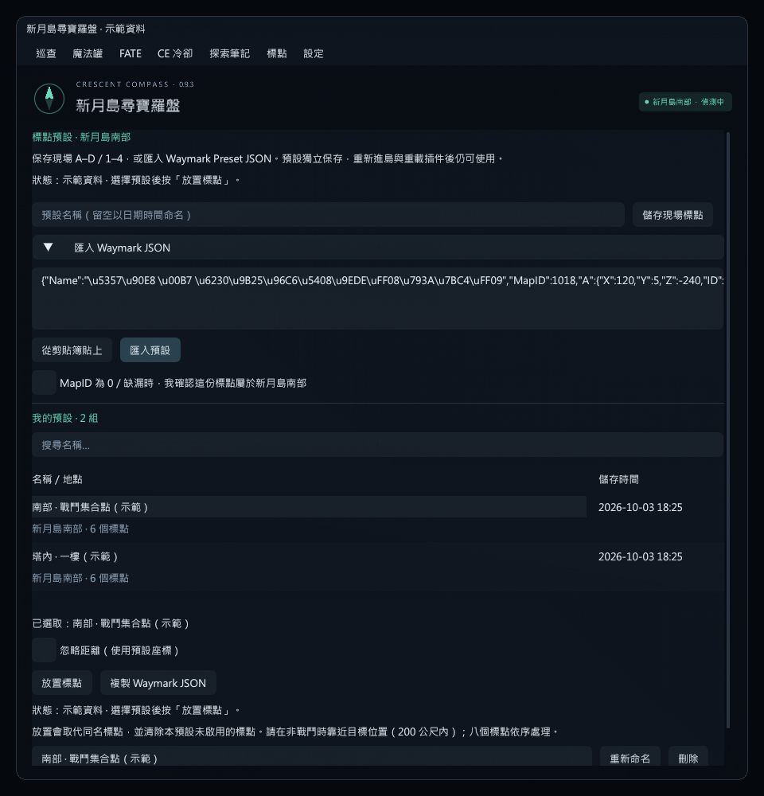

# 新月島標點預設 · 0.9.3

0.9.3 新增「忽略距離（使用預設座標）」選項。選取預設後勾選，再按「放置標點」；直接使用保存／匯入的 XYZ，略過插件 200 公尺檢查與兩次地面射線校正。遠處地形可能未載入，這個模式不依賴當前地形資料，也不改寫高度。設定預設關閉、切換後保留；進行中的整批操作固定使用啟動時的模式，完成或取消後才能切換。

0.9.2 修正地面三角形有效、但 RaycastHit.Normal 未填入時誤判不能放置的問題。先用三角形邊向量的叉積計算法線，非三角形碰撞物才使用有效的原生法線；仍拒絕陡坡、地面背面、無法確認的地面與錯誤樓層。保持原本儲存座標與檔案格式，既有預設可繼續使用。

## 使用

0.9.5 新增 [標點俯視與力之塔場地預覽](WAYMARK_PREVIEW.md)：選取預設後即可查看配置及四個王房輪廓，不需先放置。

1. 輸入 `/crescent waymarks`，或從頂部「標點」選單開啟「儲存、匯入與還原」。
2. **儲存現場**：進入新月島南部，手動放好 A–D／1–4，輸入名稱後按「儲存現場標點」。名稱留空時自動用本地日期時間命名；至少要有一個啟用標點。保存座標包含高度，不使用地圖 X/Y 取代世界座標。
3. **匯入**：展開「匯入 Waymark JSON」，貼上 Waymark Preset Plugin 的單組匯出文字，再按「匯入預設」。也接受 Markdown JSON 程式碼框。可在島外操作；匯入後不會自動放置。
4. **放置**：選擇預設並按「放置標點」。一般模式需要走近目標場地，需變更的啟用標點在玩家 200 公尺內且有已載入的地面；遠距離請勾選「忽略距離（使用預設座標）」。目前只支援南部。請保持非戰鬥；每個修改至少相隔 600 ms，八個位置約需五秒以上，忙碌或失敗可能更久或停止。
5. 可以搜尋、重新命名、「複製 Waymark JSON」或刪除所選預設。刪除有一次視窗內確認，只刪預設資料，現場標點保留。

放置會取代 A–D／1–4 的相應位置，並清除本預設未啟用的標點。一般模式會先驗證**全部需變更的啟用目標**的地面才開始修改；忽略距離模式仍驗證地圖與座標數值，但不查地面。已符合預設的槽位不重放。兩種模式都會在戰鬥、傳送、換區／分流、角色切換、登出、停用插件或手動取消時停止。部分成功後中止不會回復原標點，不會重新送出已完成的步驟。

「已更新」代表讀取到本機標點狀態符合目標；這個 API 沒有獨立伺服器確認訊息，請再確認現場實際顯示。遊戲拒絕、操作持續忙碌或狀態未更新時顯示錯誤並停止。一般模式的地面只容許在原高度上下約 1 公尺內校正；忽略距離模式保持原高度，兩種模式都不會把標點移到角色腳下。

按鈕下方會顯示操作狀態，失敗時以橘色呈現；戰鬥中按鈕停用並說明原因。剛存完立刻按放置，如果現場仍完全一樣，會顯示「標點已在儲存位置」而不重新發送。驗收時：放 A → 儲存 → 手動清除或移動 A → 按「放置標點」，觀察 A 是否回到儲存位置。

每次儲存／匯入成功後，自動選取該筆預設並清空清單搜尋條件；之後仍可手動選擇其他預設，不會每幀跳回剛儲存的那一筆。對應 UI 測試驗證新預設被選中後可放置，以及後續手動換選會使用使用者選中的預設。

## 相容格式與儲存位置

標準匯出包含 `Name`、`MapID`、`A/B/C/D/One/Two/Three/Four`；每個標點有 `X/Y/Z/ID/Active`。`X/Y/Z` 是遊戲世界座標（公尺），`Y` 為高度；`ID` 0–7 只在匯出提供，匯入依欄位名稱定位，避免 ID 錯配。

新月島南部：TerritoryType **1252**、Map **967**、ContentFinderCondition **1018**。Waymark JSON 的 **MapID 必須為 1018**。MapID 0 或缺漏的舊匯出，可勾選「我確認這份標點屬於新月島南部」後匯入。其他地圖 ID 一律拒絕，即使有勾選也不改寫。上限 64 KB，拒絕重複欄位、非數值／無限大、缺少啟用標點座標、超界數值及全空預設。相同名稱與座標重複匯入不另建一筆。不同內容即使同名也保留兩份。

預設位於 Dalamud 的 CrescentCompass 設定資料夾 `waymarks.json`，不寫入遊戲的原生預設槽。無固定筆數上限，仍受磁碟與記憶體容量限制。每次更新使用暫存檔後替換，並在 `waymarks.json.bak` 留上一版；原檔若毀損則保留並停止寫入。復原時先停用插件，備份原檔，再以 `.bak` 替換後重新啟用。

這不會替 Waymark Preset Plugin 本身解鎖新月島的原生「載入預設」。匯出的 JSON 可交換保存，實際在新月島放置請使用此插件的「放置標點」。未包含 Waymark Studio 的 Base64 壓縮分享碼或整份插件設定匯入。

## TC 原生介面核對

- 目前僅適配繁中 `2026.09.14.0000.0000`，API 13。遊戲 EXE SHA256：`837B9E2893D45D22C1DDE3D1A134AF2749E0C9FFF6E2EF7246B84860F855E247`。
- 本地 Lumina 核對南部 `EnableFieldMarkerPresets=False`、`DisableFieldMarkers=False`。使用單點放置函式，保留其戰鬥／區域／操作佇列限制；不修改遊戲程式碼，不呼叫原生 PlacePreset。
- `MarkingController` singleton RVA `0x29594F0`，八個標點 `+0x1E0`，stride `0x20`；整數 XYZ `+0x10/+0x14/+0x18` 除以 1000、Active `+0x1C`。
- 單點放置 RVA `0xA0D480`（呼叫處 `0x897A25`）；清除單點 `0xA0D640`（呼叫處 `0x89A66B`）。放置使用 0–7 編號與 `Vector3*`；遊戲內節流 500 ms，此功能至少等待 600 ms 並讀回本機狀態。
- 地面射線 RVA `0x5C0080`（呼叫處 `0xC97CB6`），Framework 指標 RVA `0x2778F80`，BGCollisionModule offset `0x2B58`。射線由目標上方 1 公尺向下 2 公尺，單位法線的 Y 至少 0.7；material filter `0x8004000`。輸出 Hit.Point `+0`、V1/V2/V3 `+0x0C/+0x18/+0x24`、Normal `+0x30`。Normal 並非每種碰撞物都填入，三角形有效時使用 `normalize(cross(V2-V1,V3-V1))`；退化三角形才嘗試原生法線。
- 第一次讀取／套用檢查 EXE 雜湊，每次原生操作檢查入口 bytes；不相容或其他插件改寫入口時停止此功能。使用者仍可匯入、匯出及管理現有預設。原生操作只在 Framework 執行緒執行。

`tools/WaymarkAudit` 可唯讀核對以上 call targets、singleton、collision offset 與內嵌 profile bytes；不附帶遊戲檔案。

另核對本地 `0xA0D480..0xA0D638`：單點放置函式檢查區域／角色狀態與節流後，以輸入 XYZ 送出原生操作，未見該函式對角色與目標做 200 公尺比較。圖片中的「距離超過 200 公尺」來自本插件的 `GroundPoint`。忽略距離只略過插件的距離與地面檢查，沒有修改原生程式碼或伺服器規則；遊戲是否接受遠距座標仍需實機驗收。

參考：原作者 [WaymarkPresetPlugin](https://github.com/sourpuh/WaymarkPresetPlugin/tree/6219d87cb3ceb425efd90351191978aa9d64b87e)、[WaymarkStudio](https://github.com/sourpuh/ffxiv_waymarkstudio/tree/c1a519419e87a766efc10805a38f02ebcf9fde7f)，及 [FFXIVClientStructs BGCollisionModule](https://github.com/aers/FFXIVClientStructs/blob/main/FFXIVClientStructs/FFXIV/Common/Component/BGCollision/BGCollisionModule.cs)。公開 SDK 與插件版本不能直接當作 TC API 13 的位址，以上位址另由本地繁中 EXE 核對。

## 驗證與遊戲驗收

0.9.3 共 782 項核心檢查通過（標點相關 106 項）。新增 16 項驗證遠距模式完整保留 XYZ、不在預檢或實際操作前查地面、整批模式固定，以及座標格式、區域、戰鬥、取消和原生拒絕仍有效。UI 驗證忽略距離開關雙向切換、啟用後放置，以及放置中停用切換。下列為 0.9.2 的既有覆蓋。

766 項核心檢查通過，其中 90 項覆蓋 JSON 往返、負數高度、地圖匹配、損壞檔保護、原子替換、超過 50 筆、重新命名、刪除、600 ms 節流、忙碌上限、狀態變更中止、不重送、未填入法線的地面、陡坡與地面背面拒絕、儲存後清除再放置的回歸流程。真實 ImGui 離線測試覆蓋 JSON 文字輸入、儲存／放置／刪除確認、取消、島外／戰鬥按鈕停用、空 JSON 不可匯入與按鈕下方回饋位置；附寬版／窄版／放大字體預覽。此處未在遊戲中發送標點。

遊戲驗收：用現場手動擺放的少量標點先存一份；移動其中一點後還原，檢查位置及未啟用槽位；退出重載插件後確認預設保留。再以其匯出 JSON 匯入，驗證未增加重複資料。最後檢查遠距／不同樓層拒絕，以及放置中取消或進入戰鬥時不繼續後續標點。已知地形尚未載入、區域限制或版本不符時，以畫面錯誤為準，不強行放置。
