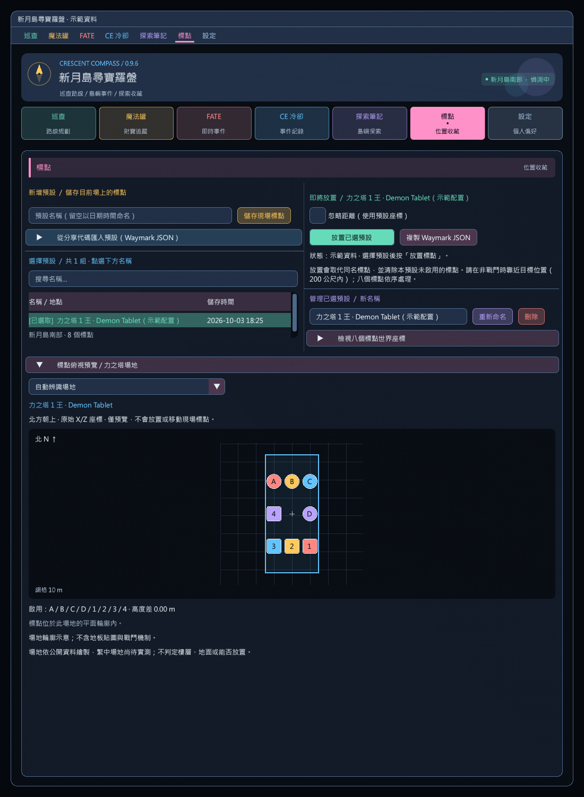
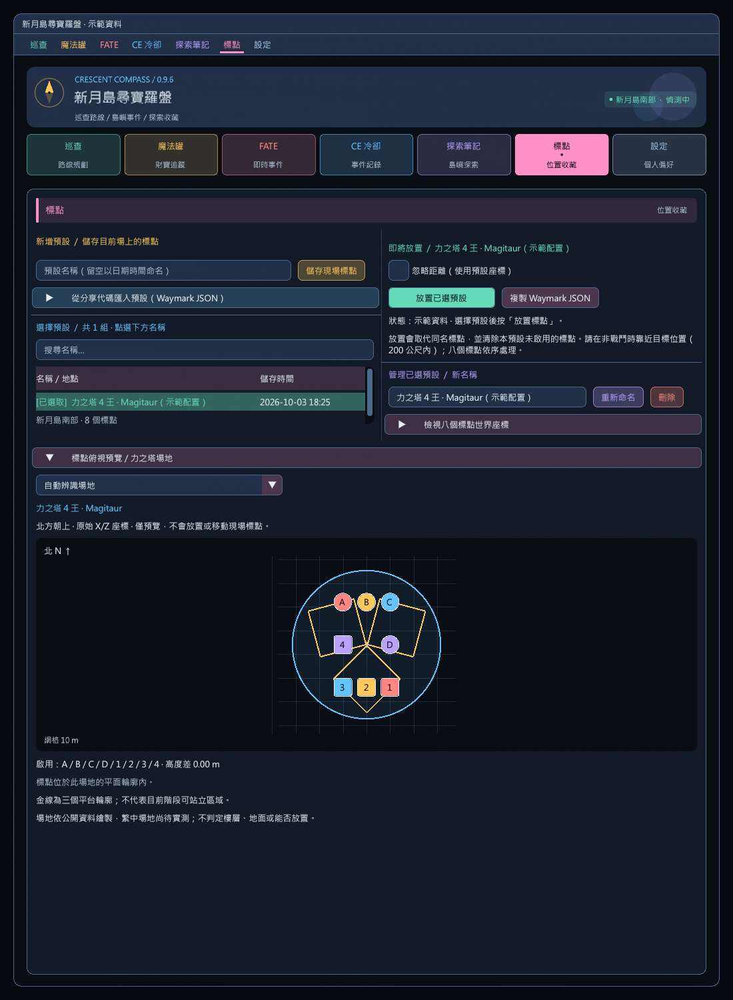

# 標點俯視與力之塔場地預覽

在標點頁選取預設，往下查看「標點俯視預覽 / 力之塔場地」。不需上島，也不需先放置標點。

- 圓形 A–D、方形 1–4；北方朝上，以世界 X/Z 等比例投影。
- 顯示啟用標點、網格比例及標點高度差；滑鼠移入可讀取 XYZ。重疊位置的提示會列出全部標點。
- 預設自動辨識力之塔王房，也可切換指定王房或只看標點。切換預設時恢復自動辨識。
- 自動辨識要求全部啟用標點位於同一王房中心 65 公尺內；不匹配就不顯示場地底圖。
- 指定場地時，畫面同時容納場地與標點；輪廓外的標點會提示，絕不搬移、旋轉或縮放儲存座標來配合場地。
- 僅繪圖，不呼叫遊戲放置／清除、不更新存檔，不改變目前標點。

## 力之塔場地

| 王房 | 世界中心 X / Z | 初始平面輪廓 |
|---|---|---|
| 1 · Demon Tablet | 700 / 379 | 寬 30、長 66 公尺 |
| 2 · Dead Stars | -800 / 360 | 半徑 35 公尺；金線標出後期半徑 30 公尺 |
| 3 · Marble Dragon | -337 / 157 | 半徑 30 公尺 |
| 4 · Magitaur | 700 / -674 | 半徑 31.5 公尺；另畫三個 20×20 公尺平台 |

底圖是靜態場地輪廓示意，不是遊戲地板貼圖。四王平台與二王縮圈同時作為參考顯示，不追蹤戰鬥階段，不表示安全區。高度不參與場地內外判定；仍需自行確認樓層和預設高度。繁中場地尚待遊戲實測。

## 資料來源

幾何座標參考 [awgil/ffxiv_bossmod 固定版本 40b0abdd](https://github.com/awgil/ffxiv_bossmod/tree/40b0abdd35e81517409bdc81446910f943a75a49/BossMod.Modules/Dawntrail/Foray/ForkedTower)。查核檔案：

- `FTB1DemonTablet/FTB1DemonTablet.cs`：ArenaCenter 與 ArenaBoundsRect。
- `FTB2DeadStars/FTB2DeadStars.cs`：初始 ArenaBoundsCircle 與 DeathWall 的縮圈半徑。
- `FTB3MarbleDragon/FTB3MarbleDragon.cs`：中心與半徑。
- `FTB4Magitaur/FTB4Magitaur.cs`：中心、半徑、平台偏移 14.5 公尺與 20 公尺邊長。

只使用場地尺寸與位置事實，未納入上游程式碼、遊戲貼圖或機制判定。介面、座標投影與測試為本專案實作。示範截圖的標點配置與高度是合成資料，不是攻略推薦。

